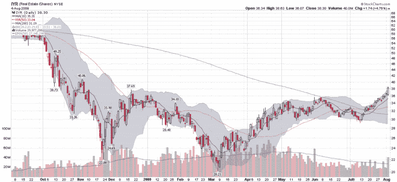

<!--yml
category: 未分类
date: 2024-05-18 17:35:22
-->

# VIX and More: Real Estate Breaks Out While the Major Indices Pause

> 来源：[http://vixandmore.blogspot.com/2009/08/real-estate-breaks-out-while-major.html#0001-01-01](http://vixandmore.blogspot.com/2009/08/real-estate-breaks-out-while-major.html#0001-01-01)

A wave of buying in the last ten minutes pushed the major indices to small gains today, following a day of lackluster trading. Stocks caught a bid early in the session following the announcement of a 3.6% increase in pending home sales for the month of June. While the broad indices bounced around near the unchanged mark all day, [real estate](http://vixandmore.blogspot.com/search/label/real%20estate) was strong throughout the day, with [IYR](http://vixandmore.blogspot.com/search/label/IYR), the popular real estate ETF, gaining 4.8% on the day.

The chart below shows today’s action constituted a breakout for IYR, which is now trading at levels not seen since early November. Today’s volume of on volume of 40 million shares was also the highest in more than two months.

Three subsector real estate ETFs posted even more impressive gains than IYR. The FTSE NAREIT Retail Capped Index Fund ([RTL](http://vixandmore.blogspot.com/search/label/RTL)) gained 6.0%, while the FTSE NAREIT Industrial/Office Capped Index Fund ([FIO](http://vixandmore.blogspot.com/search/label/FIO)) advanced 5.5% and the FTSE NAREIT Residential Plus Capped Index Fund ([REZ](http://vixandmore.blogspot.com/search/label/REZ)) added 4.9%. For more on the holdings of these three ETFs, check out [Three Commercial Real Estate Sub-Sectors to Watch](http://vixandmore.blogspot.com/2009/04/three-commercial-real-estate-sub-sector.html).

*[source: StockCharts]*