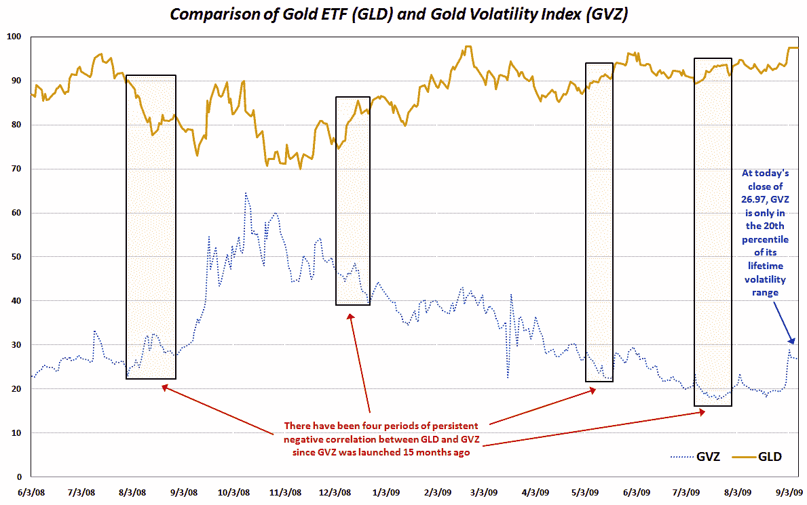

<!--yml
category: 未分类
date: 2024-05-18 17:30:31
-->

# VIX and More: Recent Developments in Gold and Gold Volatility

> 来源：[http://vixandmore.blogspot.com/2009/09/recent-developments-in-gold-and-gold.html#0001-01-01](http://vixandmore.blogspot.com/2009/09/recent-developments-in-gold-and-gold.html#0001-01-01)

With the price of [gold](http://vixandmore.blogspot.com/search/label/gold) topping $1000 per ounce today for the first time since February, there has been a great deal of discussion about gold prices and the volatility of gold prices.

While there is no disputing that gold prices are high (today they also matched their 52 week high), the comments I have seen about elevated volatility in gold are not supported by the numbers. In fact, the CBOE’s gold volatility index ([GVZ](http://vixandmore.blogspot.com/search/label/GVZ)), which is sometimes known as the “Gold VIX,” closed today at 26.97, which is in just the 20^(th) percentile of the GVZ’s range since the index was launched in June 2008\. This means that the implied volatility in the gold ETF ([GLD](http://vixandmore.blogspot.com/search/label/GLD)) is not pricing a large move in the commodity in the coming months.

Looking back at historical volatility, the numbers show volatility at historically low levels. A week ago today, for instance, GLD set a new record low for 20-day historical volatility. While historical volatility has risen slightly in the last week, it is still only in the 6^(th) percentile for HV data going back to June 2008.

A related, but little discussed phenomenon is the correlation between gold and gold volatility. I track this in several different ways, including using 10-day and 20-day rolling correlations between GLD and GVZ. In each of the last three days, the 10-day and 20-day rolling correlations have set new records, indicating that GLD and GVZ have been moving upward almost in lockstep lately, particularly for the past five trading sessions.

The correlation data do have some interesting historical precedents associated with them. For instance, the last time the 10-day rolling correlations set a new high was at the beginning of June, just as gold was topping out just below 990.

In the chart below, I have captured the movements of GLD and GVZ since the launch of GVZ. In addition, I have also highlighted some of the instances when GLD and GVZ have had a persistent negative correlation in the past.

Sometime in the near future, I will pick up the theme of extreme positive correlations between GLD and GVZ.

For additional posts on gold and gold volatility, readers are encouraged to check out:

