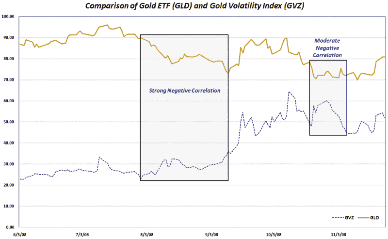

<!--yml
category: 未分类
date: 2024-05-18 18:14:02
-->

# VIX and More: Recent Gold Volatility

> 来源：[http://vixandmore.blogspot.com/2008/11/recent-gold-volatility.html#0001-01-01](http://vixandmore.blogspot.com/2008/11/recent-gold-volatility.html#0001-01-01)

I have been receiving quite a few questions about [gold](http://vixandmore.blogspot.com/search/label/gold) and gold volatility lately, so with gold receiving a lot of attention in the press, I thought this would be a good time to check in on the commodity and on the CBOE’s gold volatility index ([GVZ](http://vixandmore.blogspot.com/search/label/GVZ)), which was launched back in August.

Gold is something every investor should be watching these days as it reflects the ebb and flow of opinions about the risk of deflation in the short run and inflation over the longer run.

In the chart below, I have captured the price action in the commodity as tracked by [GLD](http://vixandmore.blogspot.com/search/label/GLD), the popular gold bullion ETF. I have also included the GVZ (aka “Gold VIX”) to gauge some of the recent volatility in gold trading. Gold volatility peaked back on October 10^(th) and has been in a gradual downtrend for the past six weeks. The chart reflects that spikes in gold volatility have generally coincided with spikes in the price of the commodity.

The broader issue of correlations between gold prices and volatility is much more complicated and subject to cyclical swings. In the chart I have highlighted two periods in which gold and gold volatility have shown a persistent negative correlation, first in August and later in mid-October. These two instances were both bearish for gold prices, yet when the correlation switched back to a positive one, gold prices began to move up in both instances.

It is still too early to draw any definitive conclusions between gold prices and gold volatility, but I will return to this subject periodically as my thinking evolves on the subject.

[source: VIX and More]