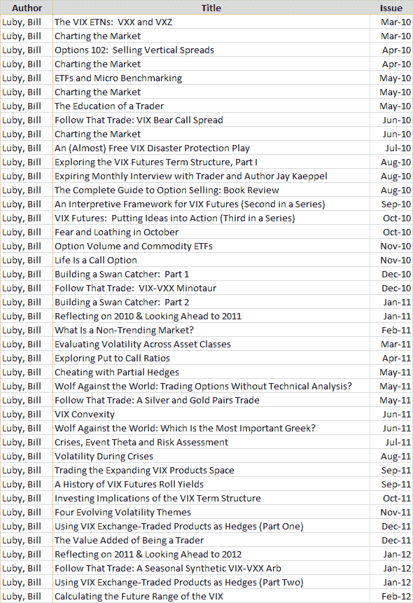

<!--yml
category: 未分类
date: 2024-05-18 16:37:19
-->

# VIX and More: Recent Research Projects and Expiring Monthly

> 来源：[http://vixandmore.blogspot.com/2012/03/recent-research-projects-and-expiring.html#0001-01-01](http://vixandmore.blogspot.com/2012/03/recent-research-projects-and-expiring.html#0001-01-01)

It occurred to me than in a recent post, [Five Years of VIX and More](http://vixandmore.blogspot.com/2012/01/five-years-of-vix-and-more.html), I neglected to mention my contributions to [*Expiring Monthly: The Option Traders Journal*](http://www.expiringmonthly.com/), where I tend to publish some of my proprietary research and analysis in a somewhat longer form (1000-4000 words) than I do in this space.

Rather than my typical screen shot of the table of contents and some brief comments on what I have been thinking about and writing for the magazine as of late, I thought that as the second year of *Expiring Monthly* has just concluded, it might be interesting to list all the titles of the 42 articles I have written for the magazine to give readers a sense of some of my more detailed research interests.

Accordingly, the graphic below lists all the articles I have written for *Expiring Monthly* in chronological order, up to and including *Calculating the Future Range of the VIX*, which was part of the February 2012 issue that was published last week.

I recently republished [The VIX-VXX Minotaur Trade](http://vixandmore.blogspot.com/2012/01/vix-vxx-minotaur-trade.html), which first appeared in the December 2010 edition of *Expiring Monthly*, in this space. [The Education of a Trader](http://vixandmore.blogspot.com/2010/09/education-of-trader.html), which also originated at *Expiring Monthly* in our editorial Back Page column, was republished here as well. Going forward, I think I will start pulling additional articles from the *[Expiring Monthly archives](http://www.expiringmonthly.com/archives.html)* (perhaps 1-2 articles per year that are at least one year past publication) and see if they can find a wider audience here. Given all the recent interest in hedging, something like *Cheating with Partial Hedges* is certainly a candidate for finding its way onto these pages.

More information on prior issues can be found by following all the posts tagged herein with the [Expiring Monthly label](http://vixandmore.blogspot.com/search/label/expiring%20monthly).  For those who are interested in subscription information and additional details about the magazine, you can find all that and more at [http://www.expiringmonthly.com/](http://www.expiringmonthly.com/).

Related posts:

******

***Disclosure(s):*** *short VXX at time of writing; I am one of the founders and owners of Expiring Monthly*