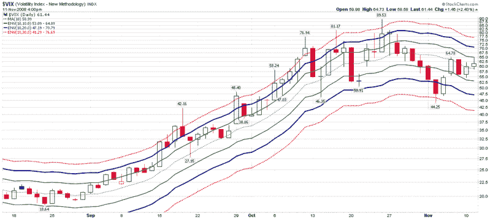

<!--yml
category: 未分类
date: 2024-05-18 18:16:48
-->

# VIX and More: Recent VIX Activity in the Context of Moving Average Envelopes

> 来源：[http://vixandmore.blogspot.com/2008/11/recent-vix-activity-in-context-of.html#0001-01-01](http://vixandmore.blogspot.com/2008/11/recent-vix-activity-in-context-of.html#0001-01-01)

I have been receiving quite a few questions about the VIX lately. These are usually of the “where is it going?” or “what does it mean?” variety, but also quite a few from the do-it-yourself crowd who want to know how to best chart the VIX.

Though it may not always appear to be the case in this space, I am a big proponent of keeping things simple. The chart below is one simple approach to thinking about the VIX. The chart utilizes three different [moving average envelopes](http://vixandmore.blogspot.com/search/label/moving%20average%20envelopes) to track where the VIX is relative to its [10 day simple moving average](http://vixandmore.blogspot.com/search/label/10%20day%20SMA). Unlike [Bollinger bands](http://vixandmore.blogspot.com/search/label/Bollinger%20bands), which expand and contract according to recent volatility trends, the moving average envelopes define fixed percentage deviations from the moving average. In the case of the chart below, the dotted green line in the center is the 10 day SMA, the solid green lines represent a 10% moving average envelope, the bold dark blue lines mark the 20% envelope, and the dotted red lines are 30% above and below the 10 day SMA.

In terms of interpretation, consider that the VIX spends of most of its life between the 10% envelopes (e.g., late August, last few days) and generally strays only briefly out of the 20% envelopes before being pulled back by mean reversion. Of course the recent historic highs in volatility had the VIX above the top of the 20% envelope for almost all of September and October and then dramatically reversing to below the bottom of the 20% envelope last week. For any time other than the recent market activity, the 30% envelopes are superfluous. Historically, these are breached about once per year and almost always when the VIX spikes up.

[source: StockCharts]