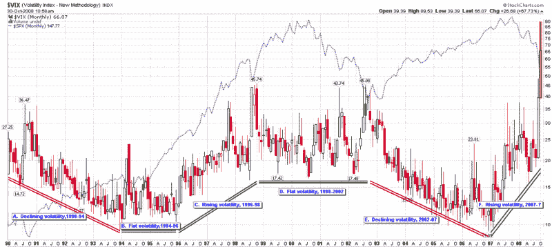

<!--yml
category: 未分类
date: 2024-05-18 18:18:09
-->

# VIX and More: Recent Volatility and VIX Macro Cycles

> 来源：[http://vixandmore.blogspot.com/2008/10/recent-volatility-and-vix-macro-cycles.html#0001-01-01](http://vixandmore.blogspot.com/2008/10/recent-volatility-and-vix-macro-cycles.html#0001-01-01)

The ~~science~~ art of [forecasting volatility](http://vixandmore.blogspot.com/search/label/volatility%20forecast) more than a couple of weeks out has always struck me as a lot more like astrology than astronomy, so it was with some mild apprehension that I thought I should update my [VIX macro cycle](http://vixandmore.blogspot.com/search/label/VIX%20macro%20cycles) chart here and see what previous posts in this area predicted for 2008.

The good news is that in December 2007 in [Was 2007 the Beginning of a New Era in Volatility?](http://vixandmore.blogspot.com/2007/12/was-2007-beginning-of-new-era-in.html), I managed at least to nail the persistence of the recent trend by noting, “the current rise in volatility should persist through all of 2008, even if the rate of rise in volatility begins to slow.” In what looked like a much safer prediction, I said, “the rate of change in volatility over the course of 2007 is unsustainable going forward – or at least inconsistent with the slope of volatility macro cycles during previous cycles.” As the monthly chart below shows, the VIX essentially moved sideways to down from July 2007 through August 2008, at which point the recent volatility began in earnest.

My most recent [VIX macro cycle update](http://vixandmore.blogspot.com/2008/03/vix-macro-cycle-update.html) comes from March 19, 2008, just three days after [Bear Stearns](http://vixandmore.blogspot.com/search/label/BSC) was sold to JP Morgan ([JPM](http://vixandmore.blogspot.com/search/label/JPM)). At that point in time many believed volatility seemed to understate the gravity of the financial turmoil. For historical context, I will repeat my assessment at the time:

> **I still anticipate that volatility will spend a good portion of 2008 in the neighborhood of 22-26\. Looking at the current [VIX futures](http://vixandmore.blogspot.com/search/label/VIX%20futures) quotes, where the May through December futures are all trading just below 26, it looks as if my prediction is on the low end of the market consensus.**
> 
>  **The big question I have is about the duration of current VIX macro cycle – and of course the slope of any continued increase in volatility. If the current slope of the volatility increase holds and the minimum cycle time is two years, that would project to a sustained VIX of about 40 by the end of the year. I don’t expect to see that scenario unfold, but it will be interesting to see how long it takes for the runup in volatility that started about 15 months ago to run out of steam.**

 **So…7 ½ months later I can say that my prediction held up through mid-September, but once [Lehman Brothers](http://vixandmore.blogspot.com/search/label/LEH) filed for bankruptcy, the [LEHVIX](http://vixandmore.blogspot.com/2008/06/lehvix.html) and VIX went through the roof and my predictions went out the window.

From a macro cycle perspective the two questions to ask now are how long the current cycle of increasing volatility should last and what direction the next cycle will take. Using the historical norms of a 2-4 year cycle and considering the steep trajectory of the recent 22 months of increasing volatility, I suspect that the current cycle is nearing an end and either topped out at the beginning of the week or will see one final topping move in the next month or two.

The direction of the next move is the bigger question and the more difficult one to answer. Two of the three previous changes in volatility have ended in a multi-year sideways move. Given some of the structural and fundamental challenges currently facing the economy, the easier prediction to make seems to be several years of elevated volatility.

I am going to go out on a limb, however, and stick to my [fear bubble](http://vixandmore.blogspot.com/2008/10/is-fear-bubble-bursting.html) thesis to predict that volatility will be on the wane over the course of the next two years or so. Don’t succumb to [anchoring](http://en.wikipedia.org/wiki/Anchoring_and_adjustment) when it comes to a VIX of 70\. Just two months ago the VIX was in the teens. While it may be awhile before the VIX returns to the teens, I would not be surprised if the VIX were back in the 20s in another 2-3 months.

Of course, a large part of the path forward will be strongly influenced by the policies and regulations put into place by governments that have yet to take office – all of which substantially increase uncertainty around any prediction.

[source: StockCharts, VIX and More]**