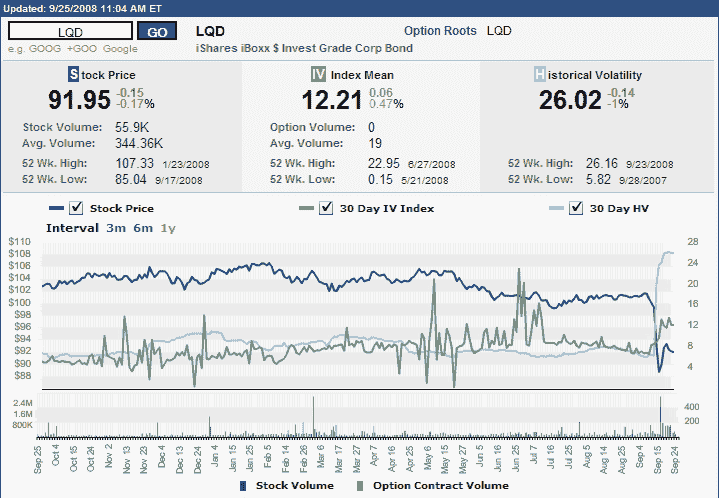

<!--yml
category: 未分类
date: 2024-05-18 18:24:52
-->

# VIX and More: Recent Volatility in Corporate Bonds

> 来源：[http://vixandmore.blogspot.com/2008/09/recent-volatility-in-corporate-bonds.html#0001-01-01](http://vixandmore.blogspot.com/2008/09/recent-volatility-in-corporate-bonds.html#0001-01-01)

There is a good reason why you rarely hear about high volatility and bonds in the same sentence. It is the same reason why people don’t debate whether the grass is growing faster on Thursday than it was on Wednesday or whether the paint is taking longer to dry than usual. For the most part, bond volatility is nano-volatility.

Until last week, that is.

The graphic below (courtesy of the [ISE](http://www.ise.com/)) shows one year of pricing, [implied volatility](http://vixandmore.blogspot.com/search/label/implied%20volatility), and [historical volatility](http://vixandmore.blogspot.com/search/label/historical%20volatility) for the iShares iBoxx $ Investment Grade Corporate Bond ETF ([LQD](http://finance.yahoo.com/q?s=lqd)). Looking solely at implied volatility, one would be tempted to conclude that March was relatively uneventful and the real difficulties in the bond market were from early May through early July. The price of the ETF and the historical volatility, however, tell another story. Rarely will you find a chart where historical volatility spiked to such dramatic levels without first seeing a rise in implied volatility that hints at what is coming.

A large part of the reason for the dramatic spike is that in addition to the general freezing of the credit markets, as recently a few months ago half of LQD’s holdings were in the financial sector. One only has to check the list of [current holdings](http://us.ishares.com/product_info/fund/holdings/LQD.htm) to see that LQD continues to own bonds issued by Lehman Brothers and [AIG](http://finance.yahoo.com/q?s=aig), as well as Wachovia ([WB](http://finance.yahoo.com/q?s=wb)), Goldman Sachs ([GS](http://finance.yahoo.com/q?s=gs)), Morgan Stanley ([MS](http://finance.yahoo.com/q?s=ms)), and other names that have recently come under extreme pressure.

Depending upon your intermediate to long-term view of the U.S. economy, LQD could be an interesting buy and hold investment, if one is interested taking an approach not too different than what is being proposed by Paulson, et al. As always, caveat emptor.

