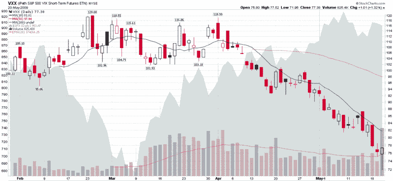

<!--yml
category: 未分类
date: 2024-05-18 17:46:50
-->

# VIX and More: Record Volume in VXX

> 来源：[http://vixandmore.blogspot.com/2009/05/record-volume-in-vxx.html#0001-01-01](http://vixandmore.blogspot.com/2009/05/record-volume-in-vxx.html#0001-01-01)

While all eyes were watching the VIX take a swan dive this morning, I failed to hear any chatter about the VIX ETN, [VXX](http://vixandmore.blogspot.com/search/label/VXX). Though admittedly not as sexy or as volatile as its index counterpart, VXX still managed to fall over 40% from its February high on the way to making a new all-time intraday low of 71.96 today, before rallying late in the session to finish the day with a gain of 1.32% and a close of 77.38.

What really got my attention, however, was today’s new record volume of 825,338 shares. Since VXX is less than four months old, traders are still getting up to speed on some of the [VXX’s idiosyncrasies](http://vixandmore.blogspot.com/2009/04/lost-in-translation-vxx-and-vxz.html). Given that VXX cannot be shorted (at least in my accounts), there was very little in the way of speculative interest in this product while volatility was cratering over the course of the past 2 ½ months.

The key takeaway, however, is that today there was a record number of bets on volatility using VXX. I suspect I am not the only one who thinks we probably just saw a [VIX bottom](http://vixandmore.blogspot.com/2009/05/where-will-vix-bottom.html).

Today may also have been the first indication that VXX has the potential to be a superb speculative vehicle in addition to a hedging tool. With an average intraday range of almost 5% and daily change approaching 3%, VXX could even join the ranks of the triple ETFs as a preferred day trading vehicle. The VIX still has a long way to go before it becomes a staple of the trading community, but today was definitely a big step in that direction.

*[source: StockCharts]*

***Disclosure****: Long VIX and VXX at time of writing.*