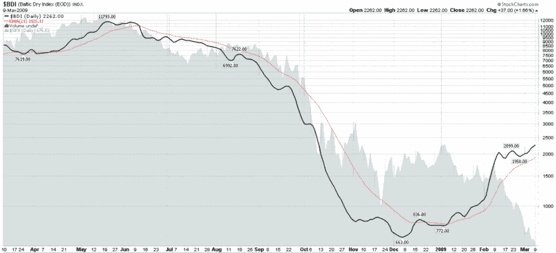

<!--yml
category: 未分类
date: 2024-05-18 17:56:35
-->

# VIX and More: Rising Baltic Dry Index a Sign of a Commodities Bottom?

> 来源：[http://vixandmore.blogspot.com/2009/03/rising-baltic-dry-index-sign-of.html#0001-01-01](http://vixandmore.blogspot.com/2009/03/rising-baltic-dry-index-sign-of.html#0001-01-01)

On the last day of 2008, I urged readers to [Watch the Baltic Dry Index in 2009](http://vixandmore.blogspot.com/2008/12/watch-baltic-dry-index-in-2009.html) for clues about the strength of global trade.

To quickly recap, the [Baltic Dry Index](http://en.wikipedia.org/wiki/Baltic_Dry_Index) (BDI) measures shipping rates for [dry bulk carriers](http://en.wikipedia.org/wiki/Bulk_carrier) that carry commodities such as coal, iron and other ores, cocoa, grains, phosphates, fertilizers, animal feeds, etc.

While I have [previously chronicled](http://vixandmore.blogspot.com/2009/01/chart-of-week-industrial-production-in.html) the dramatic drop in production in several of the world’s most important export economies, according to the Baltic Dry Index, shipping rates started moving up in December and have turned up sharply in the past six weeks. Since the beginning of the year, crude oil and copper prices have begun to firm and [commodities](http://vixandmore.blogspot.com/search/label/commodities) in general have been outperforming on a relative basis. To be fair, some of the bullish action in commodities has been due to expectations about an increase in the proposed Chinese stimulus package. Given that recent announcements from Beijing have disappointed those looking for new stimulus measures, however, one now has to consider that the BDI and commodity prices have been able to extend their recent gains without the help of increased government spending plans. This development raises the possibility that commodities may indeed be in the process of bottoming.

*[source: StockCharts]*