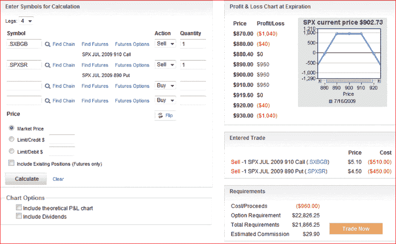

<!--yml
category: 未分类
date: 2024-05-18 17:38:37
-->

# VIX and More: Round Number Magnet Strangle

> 来源：[http://vixandmore.blogspot.com/2009/07/round-number-magnet-straddle.html#0001-01-01](http://vixandmore.blogspot.com/2009/07/round-number-magnet-straddle.html#0001-01-01)

The power of round numbers does not seem to receive a lot of play in investment circles. Sure, there is the psychological significance of an index or a stock crossing above or below a round number, but I am surprised that nobody ever talks about how to trade these.

Rather than look as round numbers as potential areas of enhanced support or resistance, I like to think of them has having a strong attractive power, almost as if they are large magnets. In some indices and stocks, prices tend to linger near round numbers for longer periods than a random distribution would suggest.

One way to take advantage of the attractive tendencies of round numbers is to sell options at or near that strike. [Straddles](http://vixandmore.blogspot.com/search/label/straddle), [strangles](http://vixandmore.blogspot.com/search/label/strangle), [butterflies](http://vixandmore.blogspot.com/search/label/butterfly) and iron [condors](http://vixandmore.blogspot.com/search/label/condor) would certainly be appropriate choices, but I have personal preference for strangles, with their wide maximum profit zone and simple construction/position management.

These ‘magnet straddle’ plays can utilize options of any duration, but maximum [time decay](http://vixandmore.blogspot.com/search/label/time%20decay) ([theta](http://vixandmore.blogspot.com/search/label/theta)) is achieved in the last few weeks prior to expiration. In the graphic below, which is courtesy of optionsXpress, I show that anyone interested in selling an 890-910 strangle on the SPX can make a profit if the index manages to stay in a 40 point zone (880-920) during the last three days prior to expiration.

I feel obliged to mention that conventional wisdom says expiration week is too fraught with short-term uncertainty and [gamma risk](http://www.investopedia.com/university/option-greeks/greeks5.asp) to be traded profitably on a consistent basis, yet I still think there are a number of opportunities where probabilities favor the experienced options trader.

Finally, if this trade sounds somewhat familiar, readers may be interested in checking out a similar straddle trade in [Is the SPX Going to Stick Close to 900?](http://vixandmore.blogspot.com/2008/12/is-spx-going-to-stick-close-to-900.html) from last December. With a VIX in the upper 50s when the original trade was discussed, the profit zone of 840-960 makes it look like a slam dunk winner by current volatility standards.

*[graphic: optionsXpress]*