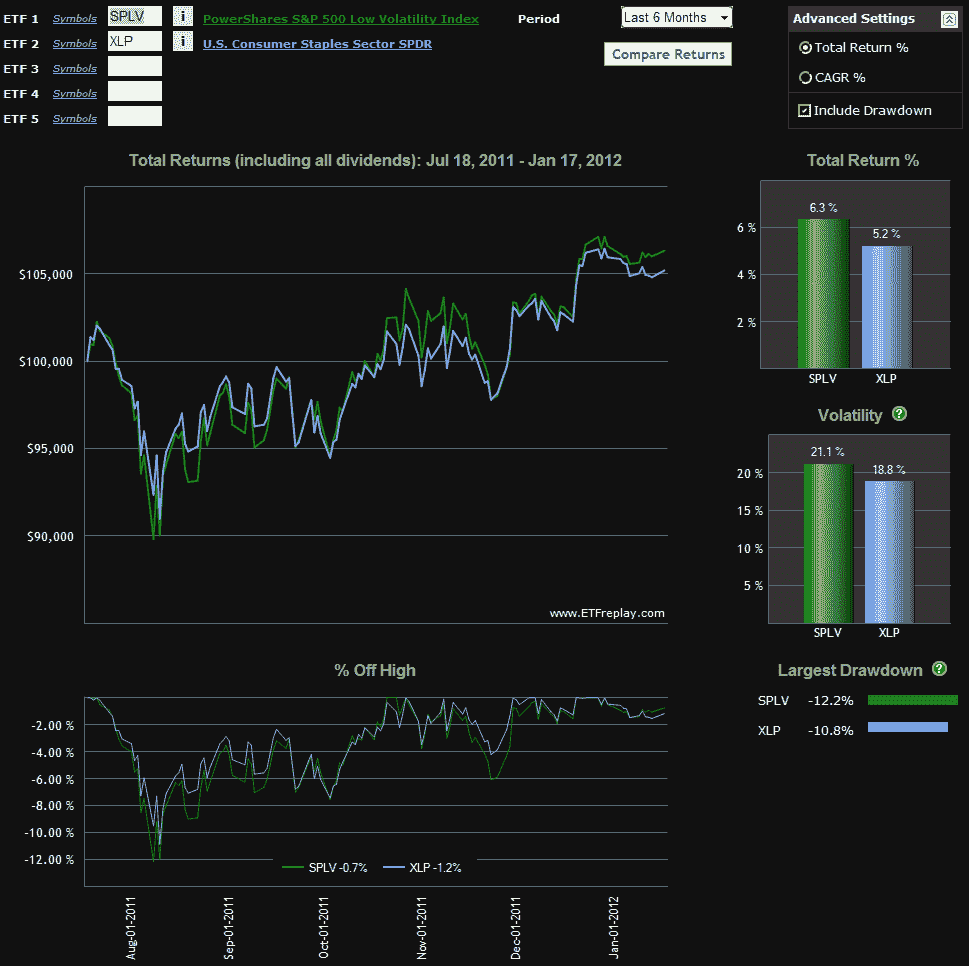

<!--yml
category: 未分类
date: 2024-05-18 16:43:02
-->

# VIX and More: SPLV vs. XLP

> 来源：[http://vixandmore.blogspot.com/2012/01/splv-vs-xlp.html#0001-01-01](http://vixandmore.blogspot.com/2012/01/splv-vs-xlp.html#0001-01-01)

The more I think about it, the less I understand the need for even more low volatility ETPs. Sure, I understand that in high volatility markets many investors want a more conservative portfolio that is insulated against sharp moves in the wrong direction.

In that respect, I can somewhat understand the appeal of the hugely popular [PowerShares S&P 500 Low Volatility Portfolio](http://www.invescopowershares.com/products/overview.aspx?ticker=SPLV) ETN ([SPLV](http://vixandmore.blogspot.com/search/label/SPLV)), which has now attracted more than $1 billion in assets in the eight months since it launched. Just last week, in [Comparing SPLV and VQT](http://vixandmore.blogspot.com/2012/01/comparing-splv-and-vqt.html), I noted that SPLV’s approach to lower volatility “is heavy on defensive stocks, with the current top sector allocations in utilities, consumer staples and health care stocks.” In fact, following its recent quarterly rebalancing, SPLV currently has approximately 31% of its portfolio invested in utilities, with another 30% in consumer staples. *[see SPLV’s top holdings [here](http://www.invescopowershares.com/products/holdings.aspx?ticker=SPLV)]*

So what is it that SPLV offers over and above an investment in a utilities ETF like [XLU](http://vixandmore.blogspot.com/search/label/XLU) or a consumer staples ETF like [XLP](http://vixandmore.blogspot.com/search/label/XLP)? Not much, as far as I can tell. I terms of performance, XLU trounced SPLV throughout 2011 and as the chart below shows, finding a distinction between the performance of SPLV and XLP since the former’s launch last May looks a lot like splitting hairs – though to be fair the gap may become more obvious with the recent rebalancing.

One can argue that other approaches which use low volatility stocks (e.g., XLU) are at least as effective in lowering volatility, as are those ETPs that use a dynamic hedging allocation based on an evaluation of market volatility and [risk](http://vixandmore.blogspot.com/search/label/risk). I touched on two of these in [Comparing SPLV and VQT](http://vixandmore.blogspot.com/2012/01/comparing-splv-and-vqt.html), notably [VQT](http://vixandmore.blogspot.com/search/label/VQT) and [VSPY](http://vixandmore.blogspot.com/search/label/VSPY).

As I see it, jumping on the low volatility bandwagon is a lot like shunning air travel because of a fear of turbulence. While that is understandable, that cross-country train is going to make it a *much* longer trip to get to the same destination.

Considering the differences across the investment universe, I realize that not everyone embraces market volatility as a period in which enhanced opportunities arise, so in 2012 one of the themes I will periodically address in this blog will be how to reduce risk, hedge and generate income – though not necessarily all at the same time.

In the meantime, consider for a moment a personal motto, “*In volatility*, *there is opportunity*!

Related posts:

**

*[source(s): ETFreplay.com]*

 ****Disclosure(s):*** *none**