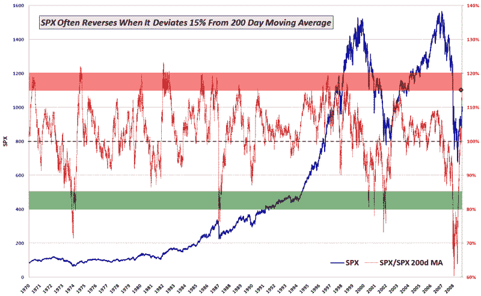

<!--yml
category: 未分类
date: 2024-05-18 17:35:33
-->

# VIX and More: SPX 15% Over 200 Day Moving Average for First Time in Ten Years

> 来源：[http://vixandmore.blogspot.com/2009/08/spx-15-over-200-day-moving-average-for.html#0001-01-01](http://vixandmore.blogspot.com/2009/08/spx-15-over-200-day-moving-average-for.html#0001-01-01)

Since I have not seen it mentioned elsewhere (which is not saying as much as it used to, given the expansion of the blogosphere), I thought it worth noting that in addition to closing over the critical 1000 level for the first time since November, the SPX also closed 15% above its simple moving average for the first time since 1999.

In the chart below, I show the daily closes of the S&P 500 index going back to 1970 (blue) and an overlay of the ratio of the SPX to its [200 day simple moving average](http://vixandmore.blogspot.com/search/label/200%20day%20SMA) (red.) With today’s close (red diamond), the SPX is now entering a level where [mean reversion](http://vixandmore.blogspot.com/search/label/mean%20reversion) trading often makes the SPX vulnerable to a reversal. That being said, the 200 day moving average will be rising at a rate of about 0.40 per trading day for the next month or so, meaning that sideways action or even small gains will help to work off some of the excess in this ratio and bring it back toward a more typical range.

Frankly, I am beginning to think that if we do not see a significant correction begin between now and Friday’s employment report, that the SPX may make a quick move to 1100\. Of course it is going to be awfully difficult to bet against the bulls until there is some evidence of an Achilles heel.

Those looking for a related upside target might be interested to know that the SPX has not closed 20% above its 200 day SMA since 1983.

For a related post, try:

*[As an aside, I somehow feel compelled to note that I had no intention of making the chart look like the national flag of some new investor nation…]*

