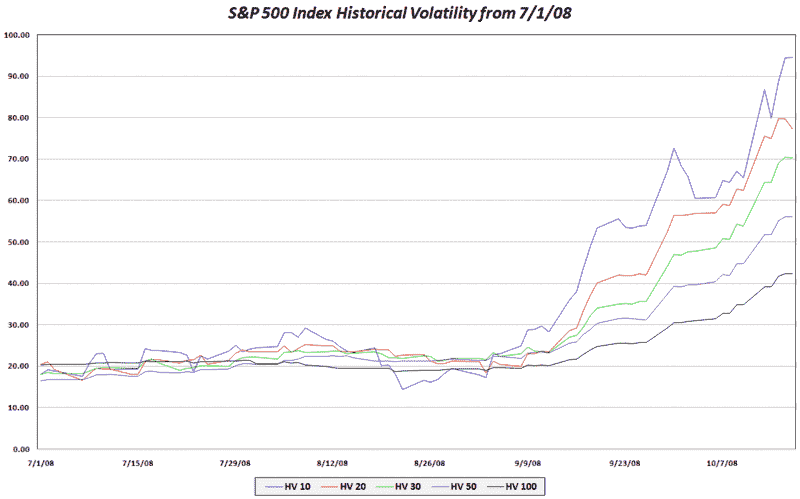

<!--yml
category: 未分类
date: 2024-05-18 18:20:14
-->

# VIX and More: SPX Historical Volatility Snapshot

> 来源：[http://vixandmore.blogspot.com/2008/10/spx-historical-volatility-snapshot.html#0001-01-01](http://vixandmore.blogspot.com/2008/10/spx-historical-volatility-snapshot.html#0001-01-01)

Adam at [Daily Options Report](http://adamsoptions.blogspot.com/) had a post up over the weekend in which he explained why he has lately [preferred 10 day historical volatility to 30 day volatility](http://adamsoptions.blogspot.com/2008/10/why-10-day-vol-over-30-day-vol.html).

Given that I track a lot of [historical volatility](http://vixandmore.blogspot.com/search/label/historical%20volatility) data, I thought it might be interesting to post a graphic showing historical volatility as calculated (essentially as the standard deviation of the log of returns) over a variety of rolling lookback periods ranging from 10-100 days. The results show a steady increase in historical volatility over the course of the past two months that is unprecedented during the course of the past two decades. Even in 1987, volatility did not continue to rise for such a long period.

With the VIX near 70 at I type this, it is tracking most closely to the 30 day historical volatility at the moment. Going forward, I will have much more to say about historical volatility, [implied volatility](http://vixandmore.blogspot.com/search/label/implied%20volatility), and the interplay between these two measures.

[source: VIX and More]