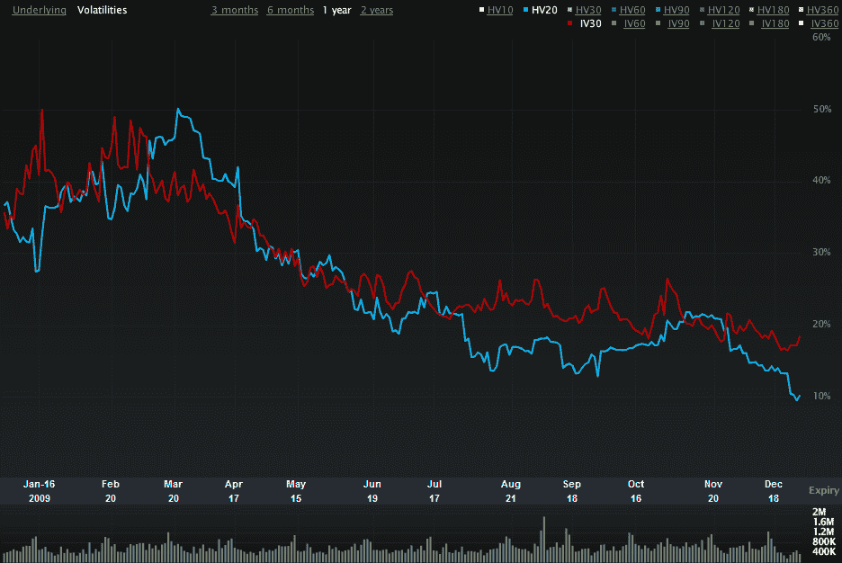

<!--yml
category: 未分类
date: 2024-05-18 17:18:20
-->

# VIX and More: SPX Historical Volatility at Two Year Low

> 来源：[http://vixandmore.blogspot.com/2010/01/spx-historical-volatility-at-two-year.html#0001-01-01](http://vixandmore.blogspot.com/2010/01/spx-historical-volatility-at-two-year.html#0001-01-01)

While it is widely understood that the VIX has a tendency to fall during the [holidays](http://vixandmore.blogspot.com/search/label/Holiday%20Effect) (due largely to fewer trading days), a point that slipped past many pundits is that [historical volatility](http://vixandmore.blogspot.com/search/label/historical%20volatility) (HV) has been excessively low during the past few weeks. In fact, last Wednesday the 20 day historical volatility in the SPX slipped below 10.00 for the first time since October 2007, about one week after the SPX topped at 1576.

Historical volatility in the SPX did rise a little to end 2009 at 10.23, but even at that level, HV sits at the 17^(th) percentile of SPX 20 day historical volatility readings for the past decade.

For the record, low HV20 readings pushed the ratio of the VIX to SPX HV20 to 2.12 on Friday – a level has only been reached four times in the last decade. Of those four instances, three (January 2000, January 2002 and May 2007) occurred prior to a substantial selloff.

The chart below shows the recent divergence between 30 day [implied volatility](http://vixandmore.blogspot.com/search/label/implied%20volatility) (red line) in the SPX and 20 day historically volatility (blue line). More often than not, when IV is substantially higher than HV, this is a bearish signal – or at least an indication that it is a good time to take profits.

For more on related subjects, readers are encouraged to check out:

*[source: Livevol Pro]*

 ****Disclosure:*** *Livevol is an advertiser on VIX and More**