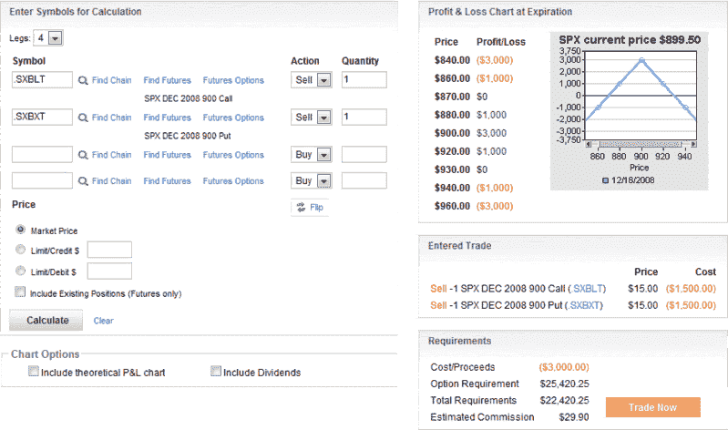

<!--yml
category: 未分类
date: 2024-05-18 18:10:20
-->

# VIX and More: SPX Straddle Case Study Update

> 来源：[http://vixandmore.blogspot.com/2008/12/spx-straddle-case-study-update.html#0001-01-01](http://vixandmore.blogspot.com/2008/12/spx-straddle-case-study-update.html#0001-01-01)

I mention very few possible trades on the blog and when I do so it is always for illustrative purposes only. As a consequence, I rarely feel an obligation to follow up on a previous post that identified a possible trade.

Today, however, seems like an opportunity that is too good to overlook because the timing and the math just happened to work out so nicely.

Exactly one week ago, in [Is the SPX Going to Stick Close to 900?](http://vixandmore.blogspot.com/2008/12/is-spx-going-to-stick-close-to-900.html), I outlined my opinion that I thought there was a strong chance the SPX “would settle in a trading range of 820-980.” I also mentioned the “possibility that the SPX might start to feel some gravitational pull around the 900 mark and start trading in an even narrower range, with the 900 area becoming a No Man’s Land of sorts.”

For those who might have similar thoughts about the market and were looking to harvest some volatility as income, I suggested a menu of strategies that included [straddles](http://vixandmore.blogspot.com/search/label/straddle), [strangles](http://vixandmore.blogspot.com/search/label/strangle), [condors](http://vixandmore.blogspot.com/search/label/condor), and [butterflies](http://vixandmore.blogspot.com/search/label/butterfly).

I chose to illustrate one possible range bound trade with a short straddle using the S&P 500 index (SPX) as the underlying. With the SPX trading at just a shade over 900 at the time, the puts and calls could each be sold for 30.00 per contract. Fast forward one week and the SPX is still hovering around 900\. After one week of time decay and a VIX that has fallen approximately 10% during that period, both the puts and calls have had their prices cut in half, from 30.00 to 15.00\.

As expiration approaches, options trades move from the realm of investment to crap shot, but it is interesting to see a real life case study in time decay in which all the numbers behave as they normally do only in a textbook.

*[source: optionsXpress]*