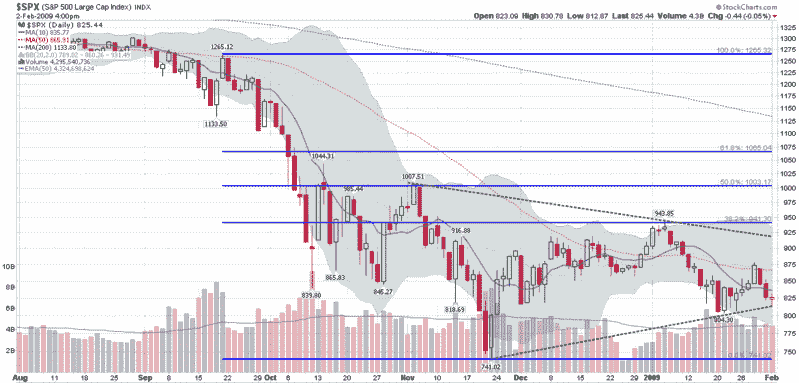

<!--yml
category: 未分类
date: 2024-05-18 18:02:02
-->

# VIX and More: SPX Symmetrical Triangle Pattern Approaching Breakout

> 来源：[http://vixandmore.blogspot.com/2009/02/spx-symmetrical-triangle-pattern.html#0001-01-01](http://vixandmore.blogspot.com/2009/02/spx-symmetrical-triangle-pattern.html#0001-01-01)

In the chart below, I show a [symmetrical triangle](http://vixandmore.blogspot.com/search/label/symmetrical%20triangle) (dotted green line) that has formed in the S&P 500 index over the course of the past 2-3 months. As the triangle narrows, the potential for a breakout move – in either direction – increases substantially.

Classical technical analysis categorizes symmetrical triangles as continuation patterns, which suggests that the most likely direction of the breakout move is down. With the SPX currently hugging the bottom of the pattern and needing to gain about 1.7 points each day just to stay above the line, treading water is not good enough. Instead, the markets will need a significant bounce to get some breathing room.

I still think a significant bounce is a strong possibility, but time is running low…

*[source: StockCharts]*