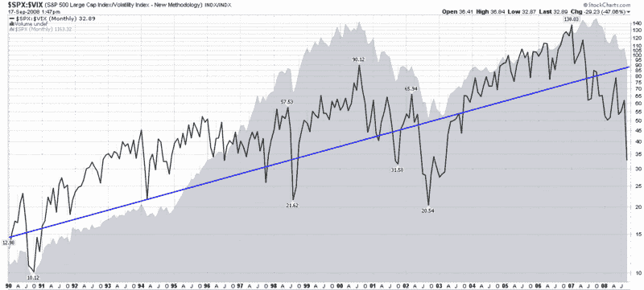

<!--yml
category: 未分类
date: 2024-05-18 18:26:22
-->

# VIX and More: SPX:VIX Ratio Sets Record for Distance Below Trend Line

> 来源：[http://vixandmore.blogspot.com/2008/09/spxvix-ratio-sets-record-for-distance.html#0001-01-01](http://vixandmore.blogspot.com/2008/09/spxvix-ratio-sets-record-for-distance.html#0001-01-01)

There are many extreme numbers being generated by the current panic in the markets. Since this blog emphasizes volatility, I wanted to share one that takes a long-term view of volatility: the [SPX:VIX ratio](http://vixandmore.blogspot.com/search/label/SPX%3AVIX).

In the chart below, I have created a graphic which tracks the ratio back to the first VIX data from 1990\. In addition to the ratio (black line) and SPX (gray area chart), I have also included a blue line that represents a 10% long-term trend line for the SPX (for additional information, try [The SPX:VIX Relationship](http://vixandmore.blogspot.com/2007/02/spxvix-relationship.html)). The key takeaway is that the SPX:VIX ratio is now farther below the trend line than it ever has been during the 19 years of VIX data.

Incidentally, the SPX:VIX ratio has been declining steadily since January 2007, some 21 months ago. As long as the 2000-2002 bear marked seemed, the SPX:VIX ratio trended down only three months more (24 months) during that bear stretch.

The SPX:VIX ratio tends to be [mean-reverting](http://vixandmore.blogspot.com/search/label/mean%20reversion) around the long-term trend line, but as the graphic shows, the path back to the mean can be a long and difficult one.

[source: StockCharts]