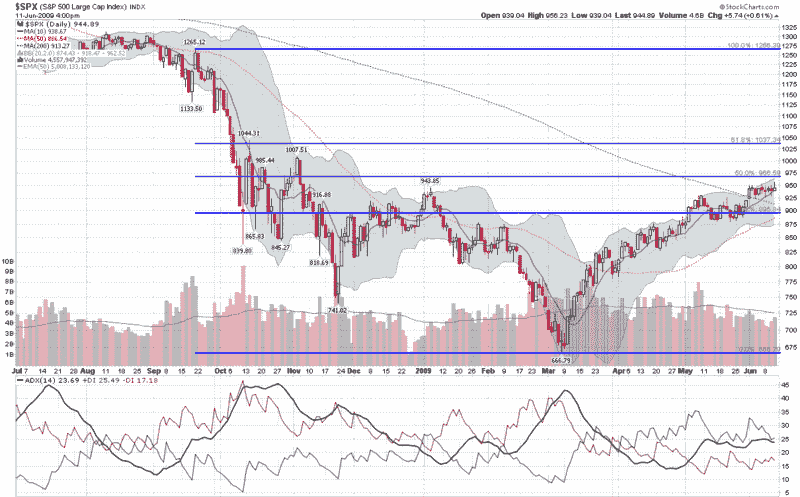

<!--yml
category: 未分类
date: 2024-05-18 17:43:14
-->

# VIX and More: SPX and Fibonacci Resistance at 966

> 来源：[http://vixandmore.blogspot.com/2009/06/spx-and-fibonacci-resistance-at-966.html#0001-01-01](http://vixandmore.blogspot.com/2009/06/spx-and-fibonacci-resistance-at-966.html#0001-01-01)

At the height of yesterday’s run up to SPX 956, a commenter took me to task for having a bearish bias in the face of a bull stampede. At the time, I was ready to close out most of my short positions, but this decision was conditional on how the market closed. As it turns out, the bearish momentum at the close was enough for me to leave my short positions on.

When it comes to rising markets, there are two things I know for certain:

1.  It is very difficult to predict where a strong bull move will run out of steam

2.  Few things in life are more frustrating/expensive than being short when the bulls are pushing stocks to new highs

Combine the two above ideas and the smart play is to wait for a top to be established and at least one lower high to follow before thinking about establishing short positions. There is, however, a case to be made for anticipating some market reversals and the current situation has three important ingredients: resistance; declining momentum; and a large magnitude move that is ripe for reversal.

The chart below highlights some of these issues. I have added Fibonacci retracement lines in blue that utilize the late September post-Lehman highs as their starting point. The key post-Lehman Fibonacci resistance is 966 in the SPX, which represents halfway between the 1265 high and 666 low. In terms of declining momentum, in addition to the obvious recent range-bound trading, the Average Directional Indicator ([ADX](http://vixandmore.blogspot.com/search/label/ADX)) shows trend strength (black line in bottom portion of graph) stalling below the 25 level, which signals a weak trend. Further, the positive directional indicator (+DI, green line) is showing an even more rapid loss of positive momentum. Finally, the move from 666 to 956 was a little over 43% and was accomplished in the absence of any meaningful pullback along the way. In other words, this is a large move that is ripe for a retracement.

Of course there are a number of other technical factors that can support the bear case, but this is an outline of the basic premise.

Right now I am short, but it is a relatively small position. Should the bears demonstrate an ability to gain some traction, I will add to that position quickly.

If the SPX closes above 967, I will exit my short positions and return to a more bullish posture.

*[source: StockCharts]*