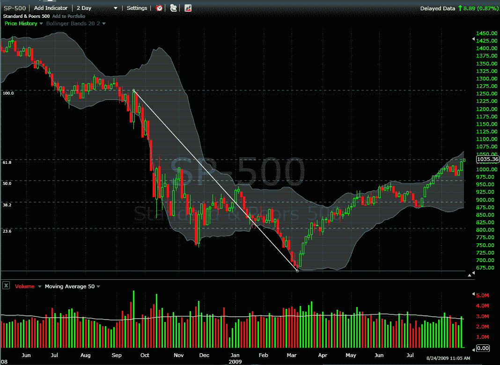

<!--yml
category: 未分类
date: 2024-05-18 17:32:12
-->

# VIX and More: SPX at Post-Lehman Fib Retracement Target of 1035-1037

> 来源：[http://vixandmore.blogspot.com/2009/08/spx-at-post-lehman-fib-retracement.html#0001-01-01](http://vixandmore.blogspot.com/2009/08/spx-at-post-lehman-fib-retracement.html#0001-01-01)

There have been several posts (see below) in this space that have addressed the issue of Fibonacci retracements in the S&P 500 index. In the dialogue, I have been a proponent of using a post-Lehman high in conjunction with the March low to arrive at a set of post-Lehman Fibonacci retracement numbers. Depending upon whether one uses just the real bodies of the candlestick (open and close) or includes the shadows (adds intraday highs and lows), the 61.8% retracement of the post-Lehman high falls in the range of 1035 to 1037.

A short while ago, the SPX established a new high for the year of 1035.82, which puts it right at the post-Lehman Fibonacci retracement target price, as shown in the chart below, which uses relatively unusual two-day candles.

I have been waiting patiently for two or more consecutive days of weakness and/or a 5% pullback from the highs to open up some aggressive short positions. With the Fibonacci retracement target hit, I am now more likely to start to scale into some short positions early, assuming we start to see some sort of meaningful weakness in stocks this millennium…

For some related posts on the SPX and Fibonacci retracements, try:

*[source: FreeStockCharts.com]*