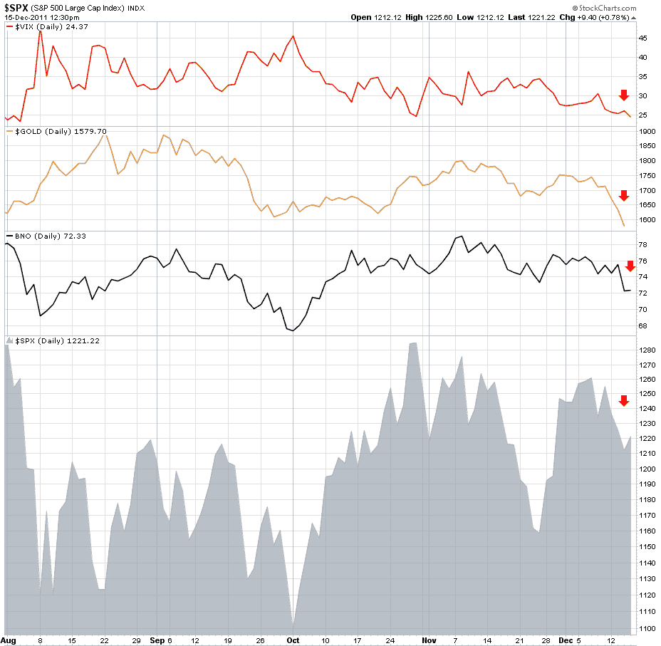

<!--yml
category: 未分类
date: 2024-05-18 16:45:54
-->

# VIX and More: Safe Haven Options Shrinking?

> 来源：[http://vixandmore.blogspot.com/2011/12/safe-haven-options-shrinking.html#0001-01-01](http://vixandmore.blogspot.com/2011/12/safe-haven-options-shrinking.html#0001-01-01)

Back in February, in [Chart of the Week: Flight-to-Safety ETPs](http://vixandmore.blogspot.com/2011/02/chart-of-week-flight-to-safety-etps.html), I examined the year-to-date performance of five exchange-traded products (ETPs) that are central to the flight-to-safety trade: volatility ([VXX](http://vixandmore.blogspot.com/search/label/VXX)), gold ([GLD](http://vixandmore.blogspot.com/search/label/GLD)), crude oil ([USO](http://vixandmore.blogspot.com/search/label/USO)), the dollar ([UUP](http://vixandmore.blogspot.com/search/label/UUP)) and U.S. Treasuries ([TLT](http://vixandmore.blogspot.com/search/label/TLT)). At that time, the [Arab Spring](http://vixandmore.blogspot.com/search/label/Arab%20Spring) was considered to be the main risk to portfolios and I noted that with the exception of crude oil, none of these supposedly safe havens had been profitable for the first two months of the year.

Ten months later the risk landscape is a much different one and TLT (+33.7), GLD (+10.2%) and VXX (+8.4%) have all lodged fairly impressive gains. While the dollar is flat, the picture in crude oil depends on where you look, with USO down 6.0% and [BNO](http://vixandmore.blogspot.com/search/label/bno) (a much better measure of global crude oil prices) up 15.7%.

So while it seems as if the safe havens have had a good year, a large part of that picture has changed during the first two weeks of December. Most notably, implied volatility, gold and crude oil have declined sharply in concert with stock prices, with all three acting as ‘negative hedges’ and adding insult to injury for those who were looking to cushion losses instead of exacerbate them.

Of the big five flight-to-safety vehicles, this leaves just U.S. Treasuries and the dollar as having been successful during the first half of December. With rates on the U.S. Treasuries at all-time lows and seemingly everyone waiting to time the Bill Gross short trade better than the bond master himself, this leaves only a currency that is less debased than most of its competition.

So where is the safe haven? Not too many years ago, many thought real estate was the best safe haven.

Right now one interesting short-term play is [EUO](http://vixandmore.blogspot.com/search/label/EUO), the [ProShares UltraShort euro ETF](http://www.proshares.com/funds/euo.html), where the ETFs objective is to move -2x the daily direction of the euro.

Related posts:

**

*[source: StockCharts.com]*

 ****Disclosure(s):*** *short VXX and TLT at time of writing**