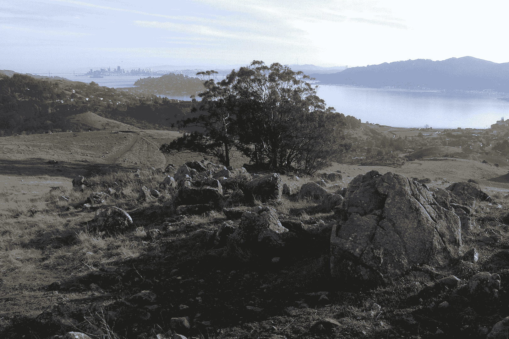

<!--yml
category: 未分类
date: 2024-05-18 17:32:48
-->

# VIX and More: Say Hello at the San Francisco MoneyShow Tomorrow

> 来源：[http://vixandmore.blogspot.com/2009/08/say-hello-at-san-francisco-moneyshow.html#0001-01-01](http://vixandmore.blogspot.com/2009/08/say-hello-at-san-francisco-moneyshow.html#0001-01-01)

Since I started this blogging adventure in early 2007, I have had the pleasure of developing relationships with quite a few people across the globe. So far I have had an opportunity to meet only a few of them in person, but that will start to change in the coming year, as I expect to attend a number of industry functions. Tomorrow I will be at the local [San Francisco MoneyShow](http://moneyshow.com/sfms/main.asp) at the [San Francisco Marriott](http://www.marriott.com/hotels/travel/sfodt-san-francisco-marriott/) and will be at the [greenfaucet](http://www.greenfaucet.com/) booth (#616) from noon until 1:30 p.m. If you are at the event and want to stop by and say hello, I am looking forward to putting some faces behind the names. If you are on the fence about coming, registration is free (register [here](https://secure.moneyshow.com/msc/sfms/registration.asp?sid=sfms09&newReg=t&scode=014721)) and between the speakers and the exhibitors, there is sure to be something in the investment world that is of interest to you.

Of course, if you can’t make it to San Francisco, feel free to drop me a note any time. While not always successful, I do my best to stay current with email and comments on the blog.

*[photo of San Francisco from Ring Mountain, Tiburon, CA]*