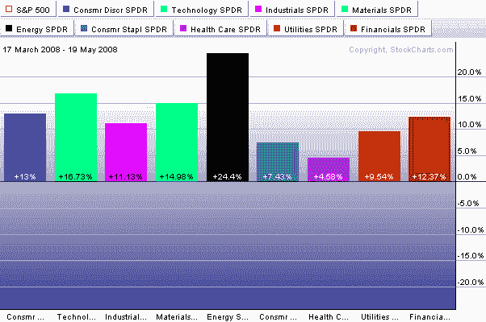
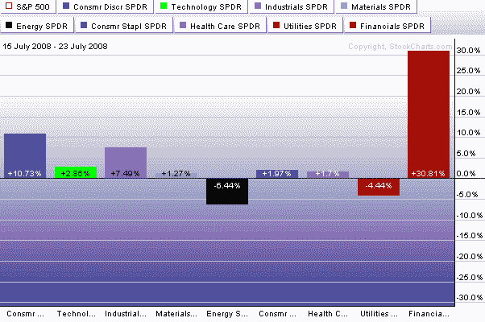

<!--yml
category: 未分类
date: 2024-05-18 18:31:27
-->

# VIX and More: Sector Performance in the Last Two Bull Moves

> 来源：[http://vixandmore.blogspot.com/2008/07/sector-performance-in-last-two-bull.html#0001-01-01](http://vixandmore.blogspot.com/2008/07/sector-performance-in-last-two-bull.html#0001-01-01)

I have been fielding a bunch of questions about sectors, particularly oil and energy, over the past few days.  Included in most of my responses has been a comparison of the March to May bull move and the most recent move that came off of the July 15^(th) bottom.  Since I rarely repost content from my [subscriber newsletter](http://vixandmoresubscriber.blogspot.com/), I thought it might be a good excuse to cut and a paste a section from Wednesday’s newsletter on sectors:

> Let me reflect on the nature of the March to May rally from SPX 1256 to SPX 1440, a gain of 184 points.  As shown in the sector breakdown (top graph), there was strong sector participation across the board.  Interestingly enough, energy was the top performing sector, followed by technology and materials.  Financials fell in the middle of the pack.
> 
> Fast forward to the past six trading days and we have the SPX now 82 points above the low.  This is not quite half the move of the March to May rally, but an impressive showing for a little more than one week of work.  Note how the sector breakdown looks quite different in the current rally (middle graph).  The extent to which financials have powered the recent move is impressive, if a little lopsided.  Note that only financials are the only sector to have made larger percentage gains in the current rally than in the March to May move.  In fact, besides financials, only the industrial and consumer discretionary sectors have made at least half of the gains from the earlier rally in the more recent rally.  All the other sectors have made gains of 3% or less, with energy and utilities showing losses.
> 
> The bottom chart uses the same data as the middle chart, except that percentage gains and losses are net of the performance of the S&P 500 index.  This confirms that the financials are the only sector really responsible for moving the SPX.  The consumer discretionary sector has provided a small lift and the industrials are just narrowly beating the SPX, but without participation from financials, this rally would have a much different look and feel.

