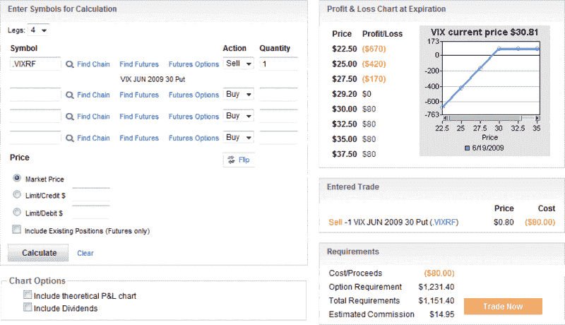

<!--yml
category: 未分类
date: 2024-05-18 17:42:34
-->

# VIX and More: Selling VIX Puts Pre-Expiration

> 来源：[http://vixandmore.blogspot.com/2009/06/selling-vix-puts-pre-expiration.html#0001-01-01](http://vixandmore.blogspot.com/2009/06/selling-vix-puts-pre-expiration.html#0001-01-01)

Selling [naked puts](http://vixandmore.blogspot.com/search/label/naked%20put) on the VIX just prior to expiration can be a surprisingly low risk volatility play.

Normally, selling naked puts is a dangerous strategy because of the risk that negative news can overwhelm the underlying, causing it to gap down and create a large loss. With the VIX, however, spikes are almost always upward, because while threats to equities are relatively easy to identify, it is much more difficult to discern when these threats are suddenly extinguished.

For this reason – and because the VIX has lately shown some reluctance to drop below the recent floor of 27 – selling a naked put on the VIX is a lot less risky than selling naked puts on other securities. Risk to the down side is definitely limited, yet the limitations are not perfectly mathematically quantifiable.

A sale of the June 30 put illustrates one potential naked put sale opportunity. The profit and loss chart below outlines what the trade looks like. With yesterday’s closing price of 30.81, the trade is profitable if the VIX rises, drifts sideways or loses up to 1.61 prior to tomorrow's [special opening quotation](http://vixandmore.blogspot.com/search/label/VIX%20SOQ). The gain is $80 per contract. The profit and loss chart shows that a loss of $170 per contract occurs at 27.50\. Assuming 27.00 is a floor in the VIX, then the maximum loss is likely to be capped at $220\. While a 12.3% drop in the VIX in one day cannot be ruled out, it is obviously not a very likely scenario.

Reminder: VIX options expire on Wednesdays. The June VIX options expire June 17^(th) this cycle. The last trading day for these options is today, Tuesday, June 16^(rd). (See the [2009 options expiration calendar](http://www.theocc.com/publications/xcal/xcal2009.pdf) for more the full 2009 options expiration schedule.)

*[source: optionsXpress]*

***Disclosure****: Neutral position in VIX via options at time of writing.*