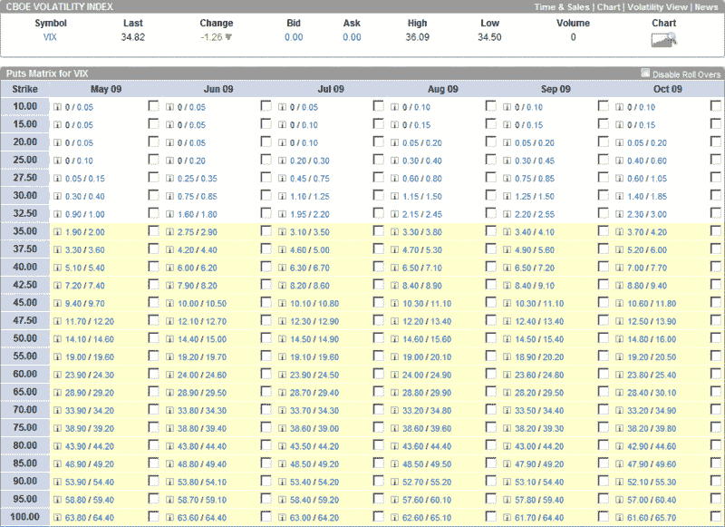

<!--yml
category: 未分类
date: 2024-05-18 17:49:38
-->

# VIX and More: Selling VIX Puts with the Help of a Put Matrix

> 来源：[http://vixandmore.blogspot.com/2009/04/selling-vix-puts-with-help-of-put.html#0001-01-01](http://vixandmore.blogspot.com/2009/04/selling-vix-puts-with-help-of-put.html#0001-01-01)

The VIX was at 51.65 when the SPX formed its “[devil’s bottom](http://vixandmore.blogspot.com/search/label/devil%27s%20bottom)” at 666.79 almost two months ago. Since then, the SPX has gone up almost exactly one third and the VIX has dropped almost exactly one third. As the SPX continues to rise – recently breaking through an important resistance level at 875 – the VIX seems somewhat reluctant to continue lower. This is consistent with my [statement of two weeks ago](http://vixandmore.blogspot.com/2009/04/some-vix-milestonesand-prediction.html) that “my personal forecast is for the recent decline in volatility to drop to no lower than the 30-32 level before flattening out.”

A floor in volatility does not necessarily mean that the VIX is destined to spike back up toward 50\. It does, however, mean that some interesting [VIX options](http://vixandmore.blogspot.com/search/label/VIX%20options) trade may present themselves. For instance, if you believe that the VIX is not likely to stay below 35, you can sell a VIX put and capture a fair amount of premium with little downside risk. While ‘little’ is a subjective term, VIX puts are less risky than other naked puts because while volatility has a tendency to spike up, the path down (except from upward spikes) is almost always a gradual one.

With this in mind, I want to highlight an options matrix feature that optionsXpress has on their site. Customers can create either a call or put matrix for any optionable security and view the bid and ask prices over the next six months in a matrix format. The graphic below shows VIX puts from May to October at all strikes from 10 to 100.

If you study the chart, you can see a great deal of interesting information. Regarding the possibility of a VIX put floor, you can see it priced in. VIX May 35 puts can be sold for 1.90 at the moment, while the June 35s fetch 2.75\. Going out further in time, however, yields very little in the way of incremental premium. The July 35s are bid at 3.10, the August 35s at 3.30, the September 35s at 3.40, etc.

For some additional fun, check out the bids for the 60 puts. They are almost identical for each month from May through October. Why? Part of the answer is that mean reversion is built into the options prices.

VIX options have some interesting quirks that take awhile for most investors to internalize. By looking at a put matrix or call matrix, however, it is much easier to get a sense of what types of future VIX moves are built into VIX options prices.

*[source: optionsXpress]*

***Disclosure****: Long VIX at time of writing.*