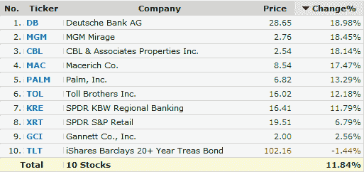

<!--yml
category: 未分类
date: 2024-05-18 17:56:21
-->

# VIX and More: Short Covering Driving Today’s Gains

> 来源：[http://vixandmore.blogspot.com/2009/03/short-covering-driving-todays-gains.html#0001-01-01](http://vixandmore.blogspot.com/2009/03/short-covering-driving-todays-gains.html#0001-01-01)

One of the best ways to determine how much short covering is behind bear market rallies is to create a portfolio consisting of stocks and ETFs for which there is a large outstanding [short interest](http://vixandmore.blogspot.com/search/label/short%20interest).

With an eye toward sorting out short-covering activity in a future rally, I put together one such portfolio yesterday, using the [Finviz.com screener](http://finviz.com/screener.ashx) to identify high volume securities where short positions are a large percentage of the float.

The results are below and show that the ten stocks in this portfolio are up an average of 11.8% halfway through today’s session, suggesting that short covering is fueling a large portion of today’s rally. Note that 7 of the 10 holdings are up more than 11% today, led by Deutsche Bank ([DB](http://vixandmore.blogspot.com/search/label/DB)) and MGM Mirage ([MGM](http://vixandmore.blogspot.com/search/label/MGM)).

*[source: FINVIZ.com]*