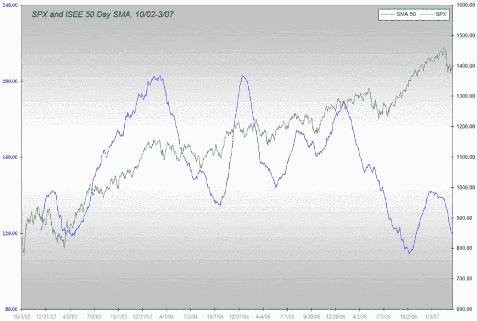

<!--yml
category: 未分类
date: 2024-05-18 15:53:04
-->

# VIX and More: Simple Moving Averages and the ISEE

> 来源：[http://vixandmore.blogspot.com/2007/03/simple-moving-averages-and-isee.html#0001-01-01](http://vixandmore.blogspot.com/2007/03/simple-moving-averages-and-isee.html#0001-01-01)

In "[A First Look at the ISEE](http://vixandmore.blogspot.com/2007/03/first-look-at-isee.html)" a reader asked about September 2006 and the predictive power of the ISEE.

Like most oscillators, the ISEE is great for getting you to buy on a pullback and less effective in timing when longer term bear trends will turn around. Depending upon where you set your trigger (say, a 10 day SMA of 120, 110 or 100), you can fine tune the percentage of downturns you want to catch and how early you might be in calling a bottom.

As an accomplished over-trader (not to be confused with uber-trader), I have a tendency to try to call turns too early. If you suffer from a similar affliction or just want to eliminate some noise from your charts, you might prefer to use a longer SMA with the ISEE, such as the 50 day version.

In the chart of the 50 day SMA below, you can see that while absolute values of the average are important, the rolling over of the trend is even more telling.

Getting back to September 2006, no the 50 day SMA had not rolled over then and it would not roll over until October. While looking at absolute numbers in the 50 day SMA might have had you long back in July, if you waited for the 50 day SMA to roll over, you would have missed out on the July to October rally.

This raises three points:

1.  No indicator is perfect and the ISEE is a good illustration of that point

2.  It is possible to maximize the value of the ISEE using both absolute SMA numbers and the rolling over of these SMAs

3.  It can be very expensive to try to time markets exactly as they turn; generally, it is much more profitable to target the middle 50% of a move than to try to capture the entire move