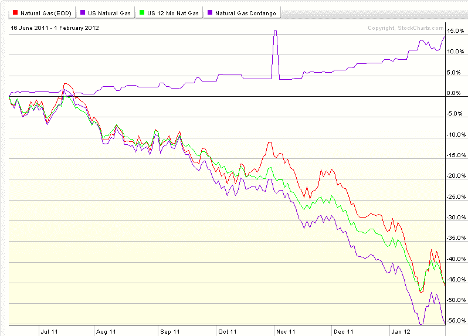

<!--yml
category: 未分类
date: 2024-05-18 16:41:33
-->

# VIX and More: Slaying the Natural Gas Contango Dragon

> 来源：[http://vixandmore.blogspot.com/2012/02/slaying-natural-gas-contango-dragon.html#0001-01-01](http://vixandmore.blogspot.com/2012/02/slaying-natural-gas-contango-dragon.html#0001-01-01)

Yesterday’s post on [Natural Gas, Contango and UNG](http://vixandmore.blogspot.com/2012/02/natural-gas-contango-and-ung.html) appears to have generated a fair amount of interest across a broad base of readers, so for an encore I have decided to forego the typical collection of [dazzling Liszt miniatures](http://www.youtube.com/watch?v=hEnfZjqMSy0) and skip directly to more on the ways to benefit from the persistent [contango](http://vixandmore.blogspot.com/search/label/contango) and negative [roll yield](http://vixandmore.blogspot.com/search/label/roll%20yield) in natural gas.

Starting with the graphic below, I have plotted the performance of natural gas (red line) and three natural gas ETPs since June 16, 2011:

*   United States Natural Gas Fund ([UNG](http://vixandmore.blogspot.com/search/label/UNG)) – blue line
*   United States 12 Month Natural Gas Fund ([UNL](http://vixandmore.blogspot.com/search/label/UNL)) – green line
*   UBS ETRACS Natural Gas Futures Contango ETN ([GASZ](http://vixandmore.blogspot.com/search/label/GASZ)) – pink(ish) line

The reason the graph begins in June 2011 is that it marks the launch of GASZ; the other two ETPs have a much longer track record.

First, note that UNG does not attempt to minimize its exposure to contango. Like many other futures-based ETPs, its objective is to hold a one-month weighted average constant maturity in its portfolio and it does this by buying second month futures and selling front month futures. UNL, launched after UNG, was an attempt by the same issuer to minimize contango by holding twelve months of natural gas futures contracts on the assumption that contango is likely to be steepest at the front end of the futures curve and flatter in the more distant months. As the chart below shows, the recent performance differential between UNG and UNL has been minimal.

The UBS ETRACS product, GASZ, takes a completely different approach and is based on a natural gas futures spread index that shorts the front month and is long some of the more distant months. In other words, this ETP is specifically designed to take advantage of contango. According to UBS:

> *“The ISE Natural Gas Futures Spread™ Index, through a series of investments in natural gas sub-indices, effectively provides short exposure in front month natural gas futures contracts and long exposure in mid-term natural gas futures contracts. This is achieved by taking a 100% long position in the components of the ISE Short Front Month Natural Gas Futures™ Index, which provides short (or inverse) exposure to the ISE Long Front Month Natural Gas Futures™ Index and an aggregate 100% long position in the components of the ISE Twelfth Month Natural Gas Futures™ Index, ISE Thirteenth Month Natural Gas Futures™ Index and ISE Fourteenth Natural Gas Futures™ Index (33.33% per index), which provides long exposure to the mid-term Henry Hub Natural Gas Futures (NG) futures contracts. The index is rebalanced monthly before the Sub-Indices’ roll process to maintain the 1:1 ratio.”*

For more information, check out the [GASZ web site](http://www.ibb.ubs.com/mc/etracs_US/alpha/gas.shtml) and [prospectus](http://www.ibb.ubs.com/mc/etracs_US/downloads/futures_prospectus.pdf).

The results, at least as seen in the chart below, show that the GASZ approach has some promise insofar as the last eight months are concerned. To be fair, GASZ is very thinly traded and has yet to inspire a broad group of investors, but here is an approach that is not likely to be correlated with any strategies investors are currently running and has been racking up profits in a sideways (at least for equities) market.

Of course investors can always short UNG, but I believe that in much the same manner that [ZIV is undeservedly neglected](http://vixandmore.blogspot.com/2012/01/ziv-undeservedly-neglected.html) as an inverse VIX futures contango play, so is GASZ overlooked for the same reasons. These are two ETPs with a lot of potential that deserve a broader audience.

Finally, as a side note, UNG announced late yesterday that it will undergo a reverse 1-4 split following the market close on February 21\. Here is a product that is down more than 40% in each of the last three years and is already down more than 21% in 2012\. Don’t be surprised if this is not the last reverse split.

Related posts:

**

*[source(s): StockCharts.com]*

 ****Disclosure(s):*** *long GASZ and ZIV,short UNG at time of writing**