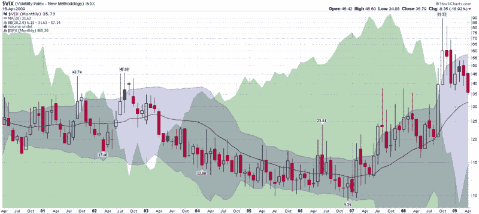

<!--yml
category: 未分类
date: 2024-05-18 17:51:37
-->

# VIX and More: Some VIX Milestones…and a Prediction

> 来源：[http://vixandmore.blogspot.com/2009/04/some-vix-milestonesand-prediction.html#0001-01-01](http://vixandmore.blogspot.com/2009/04/some-vix-milestonesand-prediction.html#0001-01-01)

It was an interesting trading day not matter how you slice it. When all was said and done the SPX had its highest close since February 9^(th) and moved as close as it has been to its [200 day simple moving average](http://vixandmore.blogspot.com/search/label/200%20day%20SMA) (SMA) since September 26^(th) of last year.

The VIX hit some interesting milestones as well. Today’s close of 35.79 was the lowest close since that same September 26^(th) and the 10 day SMA of the VIX is under 40 (as of yesterday) for the first time since the beginning of October. Elsewhere in the VIX family, the iPath S&P 500 VIX Short-Term Futures ETN, [VXX](http://vixandmore.blogspot.com/search/label/VXX), is now at its lowest level (94.91) since its January 30^(th) launch. Finally, the 10 day historical volatility in the SPX is at a 10 week low (31.18) and 20 day HV just slid below 40 for the first time in 6 weeks.

While the numbers above represent an incremental change in volatility, they also reflect a sea change in investor outlook. Just a few weeks ago it was widely believed that all the banks were insolvent, the economy was not going to turn around until 2010 and if we were lucky, the housing market might bottom before the end of the year.

A flicker of hope here and a flicker of hope there and now suddenly some of the worst case scenarios are being discarded. Perhaps it is just a case of the slowing pace of economic deterioration, but there is always the possibility that things have already started to turn up. After six months of bad news getting worse and worse news morphing into terrifying, even just being able to set aside a couple of the potential disaster scenarios seems to be cause for celebration. But, are the celebrations premature?

Volatility is notoriously difficult to predict, but my personal forecast is for the recent decline in volatility to drop to no lower than the 30-32 level before flattening out, perhaps just in time to meet the 20 month SMA in the (monthly) chart below.

If you have not looked into or traded VXX, next week might be a good time to think about hedging or speculating on an upside move in volatility with this [VIX ETN](http://vixandmore.blogspot.com/search/label/VIX%20ETN).

*[source: StockCharts]*