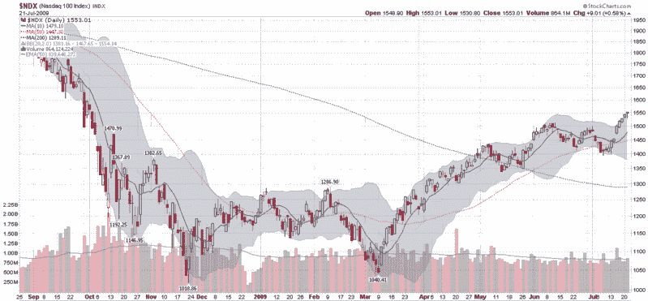

<!--yml
category: 未分类
date: 2024-05-18 17:37:36
-->

# VIX and More: StockCharts.com Charts on the Blog

> 来源：[http://vixandmore.blogspot.com/2009/07/stockchartscom-charts-on-blog.html#0001-01-01](http://vixandmore.blogspot.com/2009/07/stockchartscom-charts-on-blog.html#0001-01-01)

By far, my favorite stock charting site on the web is [StockCharts.com](http://stockcharts.com/), from which quite a few screen shots have been imported into the blog.

Recently I have fielded a few questions about my StockCharts charts and I wanted to spend a little time talking about the information contained in these charts. For starters, StockCharts offers what they call a “[gallery view](http://stockcharts.com/charts/GalleryView/)” for each ticker. This is a group of three free charts consisting of a daily chart with five months of data, a weekly chart with two years of data and a point and figure chart. StockCharts members also have a fourth intraday utilizes ten minute bars for the past four days.

While these gallery charts are an excellent starting point, the true power of StockCharts is in creating custom charts. At the bottom of this post is what I would call my “standard chart” from StockCharts, which uses daily bars over the course of the past eleven months. My standard chart utilizes candlesticks because I prefer the informational content that can be displayed in one candle. I also utilized three simple moving averages: 10 days (solid blue line) for the short-term; 50 days (dotted red line) for the intermediate-term; and [200 days](http://vixandmore.blogspot.com/search/label/200%20day%20SMA) (dotted green line) for the longer-term. These are widely-used moving averages and the selection is somewhat arbitrary. I prefer the 10 day to the more common 20 day because I often have a very short-term time horizon and because the 10 day is utilized heavily by traders who follow the VIX.

The gray cloud around the candlesticks is [Bollinger Bands](http://vixandmore.blogspot.com/search/label/Bollinger%20bands), set to 20 days and two standard deviations. I like to use Bollinger Bands to give a sense of the ebb and flow of [historical volatility](http://vixandmore.blogspot.com/search/label/historical%20volatility) superimposed on the price data, rather than as a separate study above or below the main price chart. I choose to display these by area instead of the more typical lines because I want to limit the lines cluttering up the chart and give some semblance of visual clarity. According to extensive studies done by John Bollinger, one would expect 88-89% of all future daily price moves to fall within the range defined by the current Bollinger Bands – assuming, of course, the future resembles the past.

The only other graphical data on this chart is the volume data, which includes a 50 day exponential moving average line in purple, making it relatively easy to identify large volume spikes.

Finally, a reader recently asked why the y-axis is not proportional. The short answer is that charts can be plotted with a standard (proportional) y-axis or using a logarithmic axis. The benefit of a standard axis is the ease of measuring absolute changes: ten points up and ten points down are the same height. For longer periods, however, compounding distorts percentage changes, so a logarithmic axis ensures that percentage moves up and down are the same height. Consider a $100 stock. If it goes up 50% three years in a row, it ends up at 337.50 (100*1.5*1.5*1.5) a change of 227.50 points. But if the same stock goes down 50% three years in a row, it will be at 12.50, a change of only 87.50 points. On a standard y-axis, the move up 50% for three years will look 2.6 times (237.50 / 87.50) greater than the move down 50% for three years. A logarithmic axis makes sure that these percentage changes look identical to the eye. In a future post, I will talk more about logarithmic axes and use some examples to illustrate their advantages and disadvantages.

In the meantime, those with an interest in learning more about charts, high quality charts and archiving their ideas in chart form are advised to kick the tires of StockCharts.com. If you want to see some of what others have done with the available tools, check out the [public charts](http://stockcharts.com/def/servlet/Favorites.CServlet?obj=public&cmd=show&disp=RED) section.

*[source: StockCharts]*