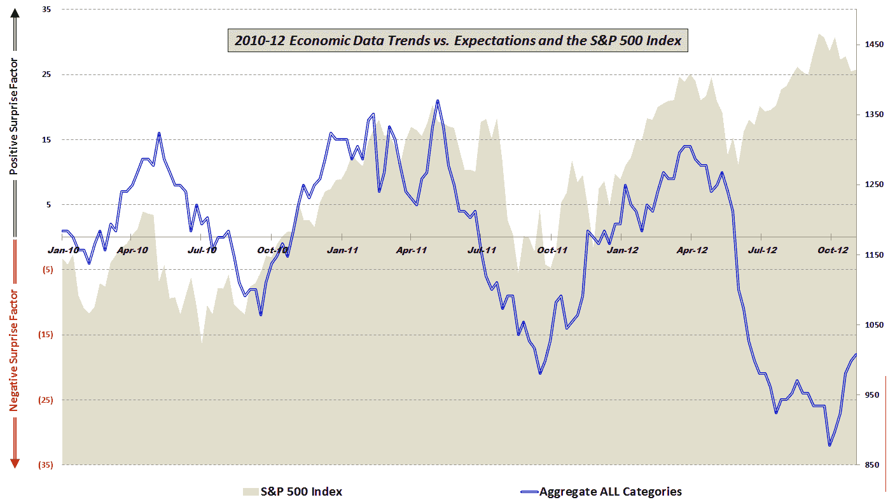

<!--yml
category: 未分类
date: 2024-05-18 16:23:59
-->

# VIX and More: Stocks and Economic Data Continue to Move in Opposite Directions

> 来源：[http://vixandmore.blogspot.com/2012/11/stocks-and-economic-data-continue-to.html#0001-01-01](http://vixandmore.blogspot.com/2012/11/stocks-and-economic-data-continue-to.html#0001-01-01)

Four months ago, in [The Economic Data Cliff](http://vixandmore.blogspot.com/2012/07/economic-data-cliff.html), I discussed the rapidly deteriorating economic data relative to expectations and noted the sudden strong divergence between economic data and the stock market

At the time I offered two potential explanations:

> *“Perhaps stocks are decoupled from reality and are merely postponing the inevitable decline, but there also exists the possibility that stock prices are beginning to reflect the possibility an economic turnaround at the end of the year or in early 2013.”*

With the benefit of four months of hindsight, the relationship between economic data and the stock market is no less murky. After being tightly correlated for 2 ½ years, stocks and economic data have been moving in almost the exact opposite direction since the beginning of June, no doubt partly due to the intervention of central banks across the globe.

What I find particularly interesting in the graphic below, however, is that just as the trend in economic data relative to expectations began diverging from stocks in June, the two began converging again when economic data began to show signs of improvement about a month ago.

Of course none of this will come as a surprise to those investors who saw today’s promising [nonfarm payrolls report](http://vixandmore.blogspot.com/search/label/nonfarm%20payrolls) as an excuse to buy some stocks this morning. For now at least, stocks and the economy continue to move in opposite directions – whether that means up or down for stocks.

*[Readers who are interested in more information on the component data included in this graphic and the methodology used are encouraged to check out the links below. For those seeking more details on the specific economic data releases which are part of my aggregate data calculations, check out* [*Chart of the Week: The Year in Economic Data (2010)*](http://vixandmore.blogspot.com/2011/01/chart-of-week-year-in-economic-data.html)*.]*

Related posts:

*[source(s): various]*

***Disclosure(s):*** *none*