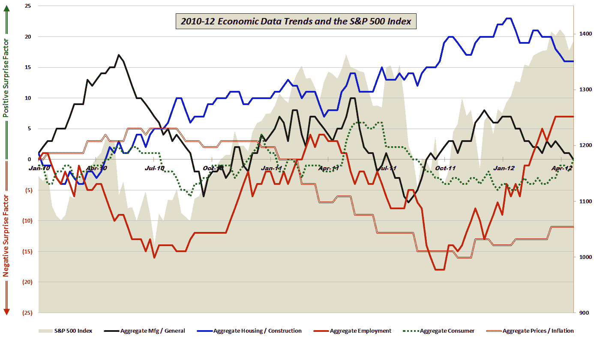

<!--yml
category: 未分类
date: 2024-05-18 16:32:30
-->

# VIX and More: Stocks and Economic Data on Upswing Despite Disappointing Manufacturing and Housing Numbers

> 来源：[http://vixandmore.blogspot.com/2012/04/stocks-and-economic-data-on-upswing.html#0001-01-01](http://vixandmore.blogspot.com/2012/04/stocks-and-economic-data-on-upswing.html#0001-01-01)

In many respects, today is a microcosm of the first 4 ½ months of 2012: [industrial production](http://vixandmore.blogspot.com/search/label/industrial%20production) and [housing](http://vixandmore.blogspot.com/search/label/housing) starts data fell short of expectations, yet stocks pushed higher regardless.

This is the third year I have been periodically publishing some proprietary data I developed with respect to economic data vs. expectations that I variously present in an aggregated format or across five groups of economic activity (manufacturing/general, housing/construction, employment, consumer and prices/inflation.) This time around I have elected to do both, with the aggregated data in the top chart and the detailed breakout in the lower chart.

The aggregated story tell the picture at 30,000 feet: economic data have been consistently topping expectations since late September and the stock market has risen in conjunction with better-than-expected news. The detail chart tells a more nuanced story. Here one can see positive surprises almost across the board in the fourth quarter of 2011, yet a rash of disappointments in 2012 in housing/construction as well as manufacturing/general economic data.

In both 2010 and 2011, it was the end of positive surprises in manufacturing and general economic data that coincided with bearish downturns in stocks. So far in 2012, the disappointments in manufacturing and general economic data have not been able to put a dent in the stock market rally. My sense is that this data and the stock market will be moving in the same direction within the next month. Whether that means an uptick in the data or a downtick in stocks remains to be seen.

*[Readers who are interested in more information on the component data included in this graphic and the methodology used are encouraged to check out the links below. For those seeking more details on the specific economic data releases which are part of my aggregate data calculations, check out* [*Chart of the Week: The Year in Economic Data (2010)*](http://vixandmore.blogspot.com/2011/01/chart-of-week-year-in-economic-data.html)*.]*

Related posts:

******

******

***Disclosure(s):*** *none*

*[sources: various]*