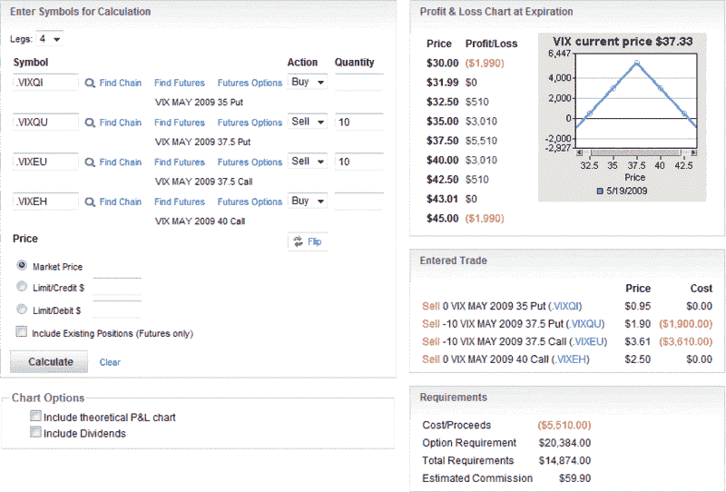

<!--yml
category: 未分类
date: 2024-05-18 17:51:47
-->

# VIX and More: Straddles vs. Iron Butterflies

> 来源：[http://vixandmore.blogspot.com/2009/04/straddles-vs-iron-butterflies.html#0001-01-01](http://vixandmore.blogspot.com/2009/04/straddles-vs-iron-butterflies.html#0001-01-01)

After receiving several questions and comments regarding yesterday’s [VIX Expiration Straddles](http://vixandmore.blogspot.com/2009/04/vix-expiration-straddles.html) and a related prior post, [A VIX Butterfly Play](http://vixandmore.blogspot.com/2009/02/vix-butterfly-play.html), I realize that I skirted a fundamental options issue that I should probably have placed more emphasis on: unlimited vs. limited risk.

The issue centers around a key concept in trading options: is the maximum loss on a position limited? In other words, at the time the position is opened, is it possible to define, in dollar terms, the maximum loss and the price points at which this loss will occur?

The question can also be addressed in graphical form.

In the profit and loss graph below, courtesy of optionsXpress, I have replicated a trade that is similar to the [straddle](http://vixandmore.blogspot.com/search/label/straddle) trade highlighted in [VIX Expiration Straddles](http://vixandmore.blogspot.com/2009/04/vix-expiration-straddles.html), except that it uses May options.

If the trade has unlimited risk, such as is the case with the short straddle below, the profit and loss graph will show diagonal lines at the extreme left and right side of the x-axis.

By contrast, it is possible to augment a short straddle position by buying insurance to protect against unlimited losses in the form of an equal amount of long calls (known in some circles as “buying the wings.”) The result is an iron [butterfly](http://vixandmore.blogspot.com/search/label/butterfly), with the “wings” limiting losses.

The graphic below shows the same trade as the short straddle above, but with the additional purchase of out of the money puts and calls. Notice how the new wings are the horizontal lines that reflect limited losses of $440 in this position.

The wings are particularly important in the event of extreme moves. In the short straddle, every dollar move in the VIX above 45 results in an additional $1000 loss. The iron butterfly, however, limits losses at 40, so the VIX can spike as much as it wishes over 40 without impacting the bottom line. The same dynamics are at work were the VIX to plunge dramatically.

Note also the cost of the insurance will reduce the maximum potential profit (which falls from $5510 to $2060) by 63% and also shrink the price range in which the trade is profitable (from 31.99 – 43.01 to 35.44 – 39.56) by the same 63%.

It may be helpful to think of the cost of buying the wings as the price of insurance to limit risk. Most traders prefer to pay the insurance premium and sleep better at night, but there are those who prefer to forego the wings and hope to avoid a disaster. This type of approach can be effective in the short-term, but over the long haul is an excellent way to lose all your trading capital.

For the record, the same relationship described above with respect to straddles and butterflies is analogous to the relationship between [strangles](http://vixandmore.blogspot.com/search/label/strangle) and [condors](http://vixandmore.blogspot.com/search/label/condor).

*[graphics: optionsXpress]*