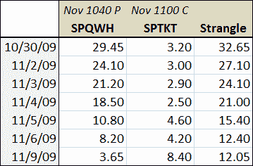
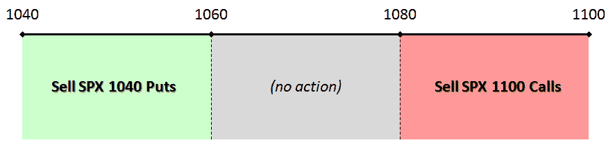

<!--yml
category: 未分类
date: 2024-05-18 17:22:55
-->

# VIX and More: Strangle Pong Update

> 来源：[http://vixandmore.blogspot.com/2009/11/strangle-pong-update.html#0001-01-01](http://vixandmore.blogspot.com/2009/11/strangle-pong-update.html#0001-01-01)

On October 30^(th), in [Strangle Pong](http://vixandmore.blogspot.com/2009/10/strangle-pong.html), I talked about the possibility of legging into an S&P 500 index [strangle](http://vixandmore.blogspot.com/search/label/strangle), starting with the sale of a November SPX 1040 put and looking to sell a November SPX 1100 call when the index rallied back over 1080.

Here we are six trading days later and the SPX November 1040 put, which was at about 24.00 at the time of my original post has fallen back to under 4.00 as I type this.

 The table to the right shows the closing values for the 1040 put (SPQWH) and 1100 call (SPTKT) since I originally mentioned the strangle (the values for today are the midpoints between the bid and ask as of 1:00 p.m. ET.) The table shows that the both the bounce in the SPX (from 1043 to 1086) and the substantial drop in the VIX (from about 28 to 23) have significantly eroded the value of the 1040 put. Interestingly, the increase in value in the 1100 call is nowhere near as dramatic as the movement of the puts, as [time decay](http://vixandmore.blogspot.com/search/label/time%20decay) has neutralized some of the gains that were realized by an increase in the underlying.

Frankly, this would be an excellent time to close out the short put position and pocket a nice profit. Sticking to the original line of thinking, however, a trader could let the short put run and short the 1100 calls to open up the other leg of the strangle. The risk-reward is not as attractive as it was for the short put, but assuming (and this is perhaps the most important assumption here) that 1100 continues to serve as upside resistance, pocketing 8.40 for the call is an attractive opportunity.

Note that this strangle is not hedged in any way. As noted previously, once can limit risk in a strangle by “buying the wings” (offsetting long put positions below SPX 1040 and offsetting long call positions above 1100) and converting this position into an iron [condor](http://vixandmore.blogspot.com/search/label/condor).

For related posts, readers are encouraged to check out:

