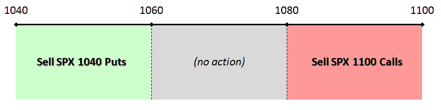

<!--yml
category: 未分类
date: 2024-05-18 17:24:14
-->

# VIX and More: Strangle Pong

> 来源：[http://vixandmore.blogspot.com/2009/10/strangle-pong.html#0001-01-01](http://vixandmore.blogspot.com/2009/10/strangle-pong.html#0001-01-01)

For the moment at least, it appears as if the S&P 500 index has encountered strong resistance at 1100 and strong support just above 1040\. Assuming these support and resistance levels can hold up for another three weeks – and that is admittedly a large assumption – then the current market environment sets up nicely for what I like to call “strangle pong” with November SPX options. Essentially, this is an approach where one assumes range-bound trading and sells near-the-money options when the underlying approaches one end or the other of the trading range.

The graphic below outlines one way to approach this type of trade. Specifically, it involves dividing the trading range into three zones (which do not have to be of equal size, they just happen to be in the diagram): an upper end of the trading range in which one sells calls; a lower end of the trading range in which one sells puts; and a neutral zone near the middle of the range in which one takes no action (or perhaps sells both puts and calls.)

In an ideal world, the underlying bounces back and forth between support and resistance just like the [pioneering computer game](http://en.wikipedia.org/wiki/Pong) and the options seller captures a high premium each time the underlying approaches the end of the range. Once both puts and calls have been sold, a [strangle](http://vixandmore.blogspot.com/search/label/strangle) is established, with the maximum profit and loss zone being defined by the target trading range.

The most important determinant of success in a strangle pong trade is the trading range of the underlying during the life of the trade. Of secondary importance is the volatility of the underlying, where increased volatility will increase the price of the options sold and work against the options seller. This is a position’s [vega](http://vixandmore.blogspot.com/search/label/vega) and is something I will address in future posts.

There are a number of ways on which position risk can be managed, not the least of which is to “buy the wings” (offsetting long put positions below SPX 1040 and offsetting long call positions above 1100) and convert this position into an iron [condor](http://vixandmore.blogspot.com/search/label/condor). According to the strangle pong approach, right now, with the SPX trading a little below 1050, would be a good time to initiate the first leg of this trade by shorting some SPX 1040 puts. Let’s see how the market moves in the next week or so; I will revisit this strangle pong trading approach at that time.

For additional posts on strangles, readers are encouraged to check out:

