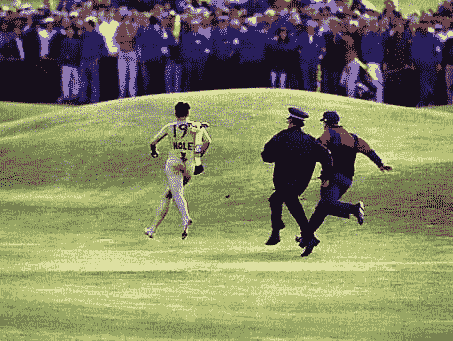

<!--yml
category: 未分类
date: 2024-05-18 15:54:25
-->

# VIX and More: Streaking

> 来源：[http://vixandmore.blogspot.com/2007/03/streaking.html#0001-01-01](http://vixandmore.blogspot.com/2007/03/streaking.html#0001-01-01)

History may eventually realize that [disco](http://en.wikipedia.org/wiki/Disco) and [streaking](http://en.wikipedia.org/wiki/Streaking) rose to extreme popularity at the almost the exact same moment in time.  I don’t know if anyone else has attempted to link the two together, but I’m not one to let the short-sightedness of others stand in my way…

In spite of my efforts here, [1974](http://timelines.ws/20thcent/1974.HTML) was a year to forget.  In one stretch from January to September, the S&P500 fell 46%.  Of course, [Watergate](http://en.wikipedia.org/wiki/Watergate) and President [Nixon](http://en.wikipedia.org/wiki/Richard_Nixon)’s resignation stole most of the headlines, but the [OPEC oil embargo](http://en.wikipedia.org/wiki/1973_oil_crisis) also sent shock waves throughout the <place st="on"><country-region st="on">US</country-region></place> and the world.  As if in sympathy, 1974 saw [Babe Ruth](http://www.baseball-reference.com/r/ruthba01.shtml)’s all-time home run record of 714 fall to [Hank Aaron](http://www.baseball-reference.com/a/aaronha01.shtml) and the [UCLA basketball team finally lose](http://www.english.ucla.edu/ucla1960s/7274/chen3.htm) after a record [88 consecutive wins](http://www.sportingnews.com/archives/sports2000/numbers/139123.html).

After selling stocks, cursing the government, waiting in gas lines, and shaking their heads at the downfall of their iconic sports heroes, people looked anywhere they could for inspiration – and it came in strange places.  [Evel Knievel](http://en.wikipedia.org/wiki/Knievel) tried to jump the [Snake River Canyon](http://www.roadsideamerica.com/tips/getAttraction.php3?tip_AttractionNo==2961) – and failed miserably.  [Muhammad Ali](http://en.wikipedia.org/wiki/Muhammad_Ali) went to [Zaire](http://en.wikipedia.org/wiki/Democratic_Republic_of_the_Congo) to fight [George Foreman](http://en.wikipedia.org/wiki/George_Foreman) in the “[Rumble in the Jungle](http://en.wikipedia.org/wiki/The_Rumble_in_the_Jungle)” – and succeeded.  Heiress [Patty Hearst](http://en.wikipedia.org/wiki/Patty_hearst) got kidnapped by the [Symbionese Liberation Army](http://en.wikipedia.org/wiki/Symbionese_Liberation_Army), [robbed a bank](http://www.sfcrime.com/patty-hearst-holdweb1.jpg), and…well, things get a little fuzzy thereafter, but it was a nice distraction at the time.

So what about streaking and disco?  Well, how the hell else were we supposed to distract ourselves from all that strange crap going on in the world?

Speaking of streaking (*finally*, he gets to the transition), the VIX has been down five days in a row.  Does that tell us anything?  Not much, really.

Here are some (potentially) interesting factoids about VIX streaks:

*   Five consecutive VIX down days happen about 1.43% of the time versus about 1.15% of the time for five consecutive VIX up days (24% less frequently)
*   53% of all five days down streaks result in a sixth down day; VIX streaks up get extended to a sixth day only 38% of the time
*   the VIX has never (since 1990) been up on eight consecutive days
*   the VIX has been down ten days in a row once (0.02%), nine days in a row five times (0.12%), and eight days in a row six times (0.14%)
*   VIX streaks of 3, 4, 5, 6, 7, 8, 9 and 10 days each occur less frequently than would be expected from random probability – again suggesting mean reversion at work