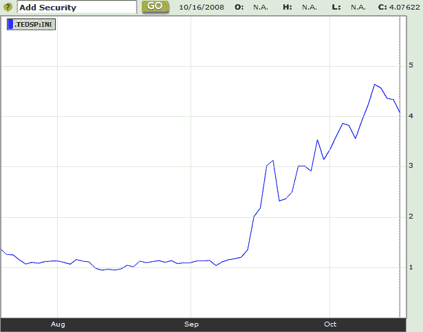

<!--yml
category: 未分类
date: 2024-05-18 18:20:28
-->

# VIX and More: TED Spread and VIX Both Coming Back to Earth?

> 来源：[http://vixandmore.blogspot.com/2008/10/ted-spread-and-vix-both-coming-back-to.html#0001-01-01](http://vixandmore.blogspot.com/2008/10/ted-spread-and-vix-both-coming-back-to.html#0001-01-01)

It remains to be seen whether [yesterday’s new high of 81.17](http://vixandmore.blogspot.com/2008/10/80s-bad-music-bad-stocks.html) in the VIX turns out to be the top in that index. Personally, I think there is a good possibility that 81.17 holds up for many years, but I also believe that it is even more likely that the [TED spread](http://vixandmore.blogspot.com/search/label/TED%20spread) (which measures the difference between [LIBOR](http://vixandmore.blogspot.com/search/label/LIBOR) rates and the yield on the [3 month U.S. T-Bill](http://vixandmore.blogspot.com/search/label/3%20Month%20Treasury%20Bill)) high of last Friday will mark the maximum point of [atherosclerosis](http://en.wikipedia.org/wiki/Atherosclerosis) in the credit markets.

In the graphic below, courtesy of Bloomberg, you can see that the TED spread has already pulled back about 14% from the October 10^(th) high.

Even a slow thaw in the credit markets and in equity volatility should be a sign that the global economy is turning the corner. In fear and panic there is opportunity; and as we turn the corner, the opportunities are greatest.

[source: Bloomberg]