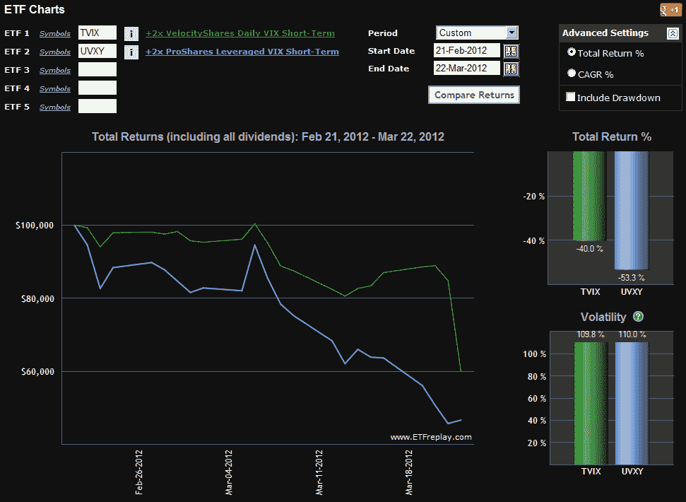

<!--yml
category: 未分类
date: 2024-05-18 16:35:18
-->

# VIX and More: TVIX Creation Units Return; What It Means for Investors

> 来源：[http://vixandmore.blogspot.com/2012/03/tvix-creation-units-return-what-it.html#0001-01-01](http://vixandmore.blogspot.com/2012/03/tvix-creation-units-return-what-it.html#0001-01-01)

One month and one day after Credit Suisse ([CS](http://vixandmore.blogspot.com/search/label/CS)) [announced](http://vixandmore.blogspot.com/2012/02/credit-suisse-suspends-creation-units.html) the suspension of new creation units in the VelocityShares Daily 2x VIX Short-Term ETN ([TVIX](http://vixandmore.blogspot.com/search/label/TVIX)), the issuer [announced](http://velocityshares.com/news/TVIX_Reopen_Press_Release_22MAR12.pdf) today that it plans to reopen issuance of TVIX “on a limited basis” effective tomorrow.

In a twist, the press release also noted:

> “Beginning March 23, 2012, Credit Suisse may from time to time issue the ETNs into inventory of its affiliates to make the ETNs available for lending at or about rates that prevailed prior to the temporary suspension of issuances of the ETNs. Also, beginning as soon as March 28, 2012, Credit Suisse may issue additional ETNs from time to time to be sold solely to authorized market makers. *Credit Suisse may condition its acceptance of a market maker’s offer to purchase the ETNs on its agreeing to sell to Credit Suisse specified hedging instruments consistent with Credit Suisse’s hedging strategy, including but not limited to swaps.* Any such hedging instruments will be executed on the basis of the indicative value of the ETNs at that time, will not reflect any premium or discount in the trading price of the ETNs over their indicative value and will be *on terms acceptable to Credit Suisse, including the counterparty meeting Credit Suisse’s creditworthiness requirements, margin requirements, minimum size and duration requirements* and such other terms as Credit Suisse deems appropriate in its sole discretion.” [emphasis added]

The references to hedging instruments consistent with Credit Suisse’s hedging strategy, swaps, counterparty creditworthiness, margin requirements, etc. may shine a light on some of the issues that Credit Suisse encountered when they elected to close the creation unit window last month.

Today’s price action has already raised some eyebrows, with TVIX falling 29.3% during the regular trading session and dropping another 11.8% after hours, while a near equivalent security, the ProShares Ultra VIX Short-Term Futures ETF, [UVXY](http://vixandmore.blogspot.com/search/label/UVXY), rose 2.1% during the standard session and was essentially unchanged after hours. As best as I can determine, news of the reopening of the creation units window broke at about 7:34 p.m. ET, at which point TVIX was already down more than 33% from Wednesday’s close. Given that the 30 million shares traded today was about as many shares as had exchanged hands in the prior week, it is reasonable to conclude that at least one party believed that new creation units were imminent and had hoped to profit by shorting TVIX ahead of the announcement. In fact the price action of TVIX was so disconnected from UVXY and the rest of the VIX ETPs that I fielded dozens of questions on the subject and concluded ([Twitter](https://twitter.com/#!/VIXandMore), [blog comments](http://vixandmore.blogspot.com/2012/03/imos-saga-cramer-and-options.html#disqus_thread)), “The continued decline in TVIX has me wondering if someone is speculating about CS re-opening the creation units window.”

Of course investors are more interested in what will happen next than what flotsam has already drifted under the bridge.

As for tomorrow’s open, first keep in mind that TVIX ended today’s after-hours session at 9.00, while indicative value is still a good deal lower at 7.83\. While Credit Suisse would no doubt like to see TVIX trade back at indicative value levels as soon as possible, the “on a limited basis” phrasing is likely to give some investors pause. Also, there are no guarantees that Credit Suisse might not feel compelled to suspend creation units again at some point in the future. For this reason, I would not at all be surprised to see TVIX continue to trade with a premium in the neighborhood of 5-10% or so at times tomorrow, dropping down to something along the lines of 2-5% next week. These numbers are pure speculation at this stage. A large part of the premium story will depend upon how limited the new creation units are and how aggressively Credit Suisse seeks to drive down the market price to the indicative value. No matter how this plays out, investors should expect that at least 90% of the divergence between TVIX and UVXY over the last month (see graphic below) will disappear tomorrow.

On a related note, investors who have become wary of TVIX during the past month have embraced UVXY to the extent that UVXY’s daily dollar volume has been running ahead of that of TVIX during the past week.  As of Monday, UVXY also has the benefit of being supported by options, with April strikes from 14 through 35 already seeing a fair amount of action. With the advents of options on UVXY (and also on the -1x inverse VIX futures ETF, [SVXY](http://vixandmore.blogspot.com/search/label/SVXY)) a new universe of trading opportunities becomes available for those who wish to speculate or hedge with VIX-based ETPs. What is most encouraging is that investors can now easily trade VIX products with defined (limited) risk positions by utilizing options. More on this at a later juncture.

In the meantime, *[T]VIX and More* will do its best to cover the TVIX story as it continues to develop.

Finally, I would be remiss in failing to point out that this space was the only place that one could find information about TVIX before and during the suspension of the creation units. The links below, which are arranged largely in reverse chronological order, provide a wealth of information about TVIX, UVXY and many of the issues facing these products.

Related posts:

**

*[source(s): ETFreplay.com]*

***Disclosure(s):*** *short TVIX and UVXY at time of writing*