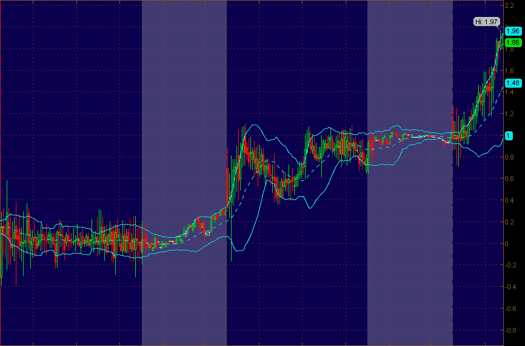

<!--yml
category: 未分类
date: 2024-05-18 16:38:40
-->

# VIX and More: TVIX Premium Spikes to 13%

> 来源：[http://vixandmore.blogspot.com/2012/02/tvix-premium-spikes-to-13.html#0001-01-01](http://vixandmore.blogspot.com/2012/02/tvix-premium-spikes-to-13.html#0001-01-01)

A little more than two hours into today’s regular trading session, the premium in [TVIX](http://vixandmore.blogspot.com/search/label/TVIX) is has spiked to 13.5% above its [intraday indicative value](http://vixandmore.blogspot.com/search/label/intraday%20indicative%20value).

The graphic below shows the difference between TVIX and TVIX.IV over the course of the past three trading sessions, using 5-minute bars and reflecting the extended hours trading sessions in the grayed-out blocks.

At this juncture, longs are likely betting that the prospect of a short squeeze, perhaps in combination with a VIX spike, could land them some significant windfall profits. Shorts, on the other hand, are assuming that it is just a matter of time before Credit Suisse ([CS](http://vixandmore.blogspot.com/search/label/CS)) reopens the creation units window for TVIX, which should restore the supply-demand equilibrium and dissolve the 13% premium in the form of a different type of windfall profit.

*[It is generally my policy not to comment on individual holdings other than to note them in the disclosure section below, but suffice it to say that as the TVIX premium increases, I find it increasingly difficult to make the bull case in terms of anticipating an additional expansion of that premium.]*

Related posts:

**

*[source(s): thinkorswim/TD Ameritrade]*

***Disclosure(s):*** *short TVIX at time of writing*