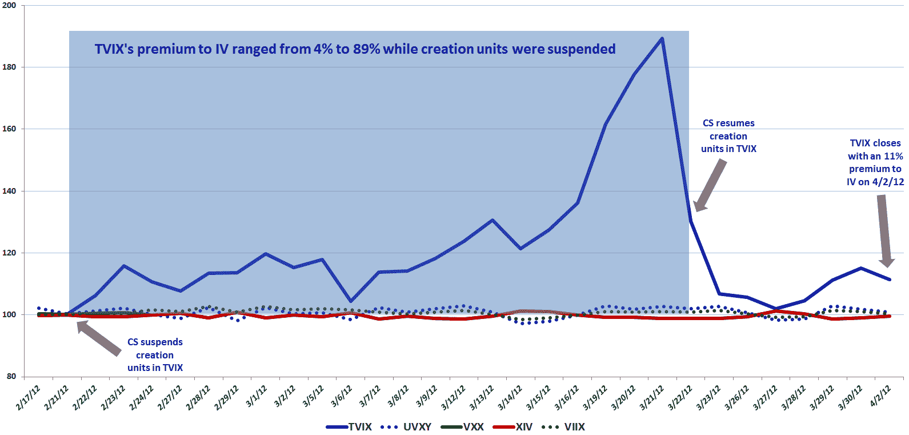

<!--yml
category: 未分类
date: 2024-05-18 16:33:59
-->

# VIX and More: TVIX Premium to Indicative Value Creeping Back Up…

> 来源：[http://vixandmore.blogspot.com/2012/04/tvix-premium-to-indicative-value.html#0001-01-01](http://vixandmore.blogspot.com/2012/04/tvix-premium-to-indicative-value.html#0001-01-01)

If you thought the [TVIX](http://vixandmore.blogspot.com/search/label/TVIX) (VelocityShares Daily 2x VIX Short-Term ETN) story was behind us, you might want to think again.

No, I am not talking about the recent [news](http://www.reuters.com/article/2012/03/30/us-finra-etns-idUSBRE82S1B520120330) that FINRA is “looking at the events and trading” associated with TVIX and more generally that the regulator has “a review under way looking at a host of issues relating to ETNs and other complex products.”

Instead, my interest is in the return of some meaningful premium in TVIX relative to its [Intraday Indicative Value](http://vixandmore.blogspot.com/search/label/intraday%20indicative%20value) (a real-time estimate of an ETP’s fair value, based on the most recent prices of its underlying securities) during the last three days.

For some historical perspective, consider that in the months prior to Credit Suisse ([CS](http://vixandmore.blogspot.com/search/label/CS)) [suspending creation units](http://vixandmore.blogspot.com/2012/02/credit-suisse-suspends-creation-units.html) on February 21, TVIX typically traded at a premium of about 0.5% above its indicative value. After the creation units were suspended, the premium vacillated wildly (as seen in the graphic below), though for several weeks the premium was locked in a relatively narrow range of 10-20%. That premium over indicative value spiked to 89% on the day before the announcement that Credit Suisse was resuming creation units. Once that resumption of creation units was announced, the premium in TVIX fell all the way back to 2% in just three days, no doubt signaling to many that it would soon be business as usual in TVIX trading.

During the last three days, however, the TVIX premium is has remained largely in the 10-15% range, ending today at 11.4%.

The knee-jerk conclusion here is that there Credit Suisse may be considering the possibility of suspending the TVIX creation units once again. Another interpretation is that while Credit Suisse indicated they would reopen issuance of TVIX “on a limited basis,” it is now likely that the limited flow of TVIX creations units has not been sufficient to establish a price equivalence between TVIX and TVIX.IV, suggesting that an imbalance of supply and demand is persisting. Given the low trading volumes for the last three days, I am inclined to believe the that imbalance is more of an issue of supply constrains than one of excess demand, but here the simple interpretation of the data may not be the proper explanation.

The fluctuations in the TVIX premium will be very interesting to watch going forward. One could argue that in spite of my many posts on TVIX, including a (pre-suspension) [reminder](http://vixandmore.blogspot.com/2012/02/will-tvix-go-to-zero.html) that the pricing supplement to the prospectus states in no uncertain terms, “The long term expected value of your ETNs is zero,” many investors had no idea what they were buying when they purchased shares of TVIX. In the six weeks since creation units were suspended, the public has had a reasonably thorough if sometimes painful education on the matter, even if some of this has come too late to avoid large losses.

Can this wiser and better educated investor class help to create another huge spike in TVIX premium? I have my doubts, but will certainly be watching in earnest. Remember that anyone who pays a 11% premium over fair value for TVIX should anticipate that the premium will evaporate sometime in the near future and that any short-terms gains will likely have to come in the form of other investors who are willing to pay an even larger premium to own an ETN that is likely to underperform [UVXY](http://vixandmore.blogspot.com/search/label/TVIX) if the VIX does spike.

As an editorial aside, while TVIX may be taking it on the chin in terms of publicity, had this product been launched prior to the 2008 financial crisis, I have little doubt that many investors would have been genuflecting in front of it during the terror that gripped the stock market during its transition to a post-Lehman world.

Related posts:

**

*[source(s): thinkorswim/TD Ameritrade, Yahoo]*

***Disclosure(s****): short TVIX and UVXY at time of writing*