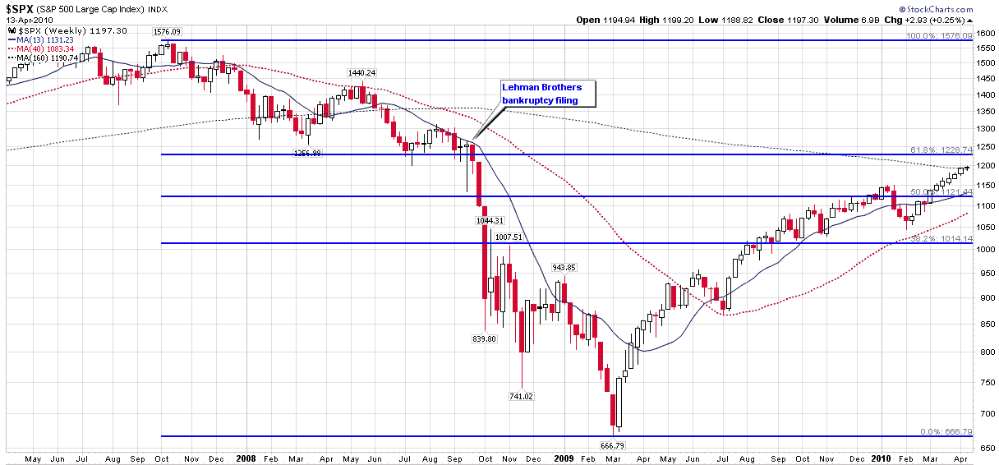

<!--yml
category: 未分类
date: 2024-05-18 17:11:52
-->

# VIX and More: Technical Resistance Looms in S&P 500 Index

> 来源：[http://vixandmore.blogspot.com/2010/04/technical-resistance-looms-in-s-500.html#0001-01-01](http://vixandmore.blogspot.com/2010/04/technical-resistance-looms-in-s-500.html#0001-01-01)

With a strong earnings report coming from Intel ([INTC](http://vixandmore.blogspot.com/search/label/INTC)) after hours, the futures are pointing to a bullish open tomorrow morning and a likely run at 1200 for the S&P 500 index.

Now that quite a few pundits already on record as saying that stocks are overextended, this seems like a good time to play the [Fibonacci](http://vixandmore.blogspot.com/search/label/Fibonacci) retracement card and suggest that significant technical resistance looms for the SPX, particularly in the area of 1225 and above.

As the chart below (three years, weekly bars) shows, SPX 1225 is technically significant for several reasons. First of all, 1228 is the 61.8% retracement level from the October 2007 high to the March 2009 low. Second, the SPX 1225-1250 zone sits just below where the index closed (1251) on the Friday prior to the Lehman Brothers bankruptcy filing. Looking farther back, the 1225-1250 zone also defines support for the March 2008 (Bear Stearns) low and subsequent lows in the beginning of July 2008\.

To quickly summarize, the SPX first has to scale the psychologically significant 1200 level, where the last close above the level was on September 26, 2008\. On the other side of 1200 looms a key Fibonacci retracement level, as well as the ghosts of Lehman Brothers, Bear Stearns and others.

Now it is possible that stocks will continue to ignore gravity and skate right past these barriers, but I suspect it is finally time that technical resistance decides to drop its gloves and fight back.

For more on related subjects, readers are encouraged to check out:

*[source: StockCharts.com]*

***Disclosure(s):*** *none*