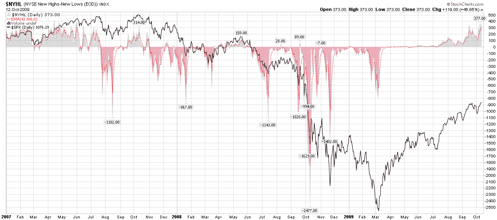

<!--yml
category: 未分类
date: 2024-05-18 17:26:36
-->

# VIX and More: The 52 Week Lookback Period and New Highs - New Lows

> 来源：[http://vixandmore.blogspot.com/2009/10/52-week-lookback-period-and-new.html#0001-01-01](http://vixandmore.blogspot.com/2009/10/52-week-lookback-period-and-new.html#0001-01-01)

[Market breadth](http://vixandmore.blogspot.com/search/label/breadth) is a great tool. It can be used to evaluate momentum and also as a contrarian indicator to help identify potential market reversals. Various breadth indicators range from simple advance-decline indicators like the [McClellan Summation Index](http://vixandmore.blogspot.com/search/label/McClellan%20Summation%20Index), to measures of new highs and new lows, and beyond.

As I have seen a fair amount of comments related to new 52 week highs and lows in recent weeks, I wanted to point out what I hope is obvious to everyone looking at these charts. First, in many respects that 52 week time frame is an arbitrary lookback period. One could easily use a lookback period of 3 months, 6 months, 2009 year-to-date, 2 years or whatever. As it happens, 52 weeks is the conventional lookback period that is baked into almost all of the new high and new low data.

I mention all this because from October 1, 2008 to October 10, 2008 the SPX was in a free fall and dropped from 1167 to 839\. As a result, a large number of stocks are making 52 week highs right now only because the lookback period no longer captures the values prior to the free fall.

So…keep a close eye on market breadth, but be wary of an artificial jump in new highs that shows new highs surging since the beginning of October. For the most part, this is a function of an arbitrary lookback period. Said another way, if you are going to be a student of technical analysis, but sure to study not just the recent data, but also the data that is scrolling off of the radar.

*[graphic: StockCharts]*