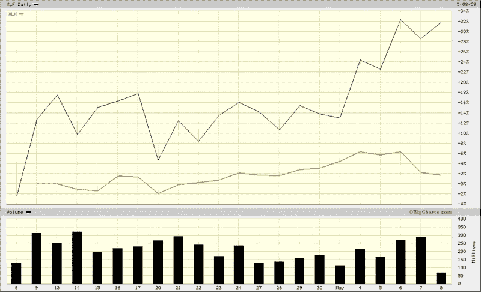

<!--yml
category: 未分类
date: 2024-05-18 17:48:22
-->

# VIX and More: The Banks vs. Technology

> 来源：[http://vixandmore.blogspot.com/2009/05/banks-vs-technology.html#0001-01-01](http://vixandmore.blogspot.com/2009/05/banks-vs-technology.html#0001-01-01)

I was going to put up a post about the recent negative divergence in technology, particularly the large cap technology companies that dominate the NASDAQ-100 ([NDX](http://vixandmore.blogspot.com/search/label/NDX)), but I noticed that Cam Hui at [Humble Student of the Markets](http://humblestudentofthemarkets.blogspot.com/) already beat me to the punch yesterday morning in an excellent [Weak Leadership Imperils Market Advance](http://humblestudentofthemarkets.blogspot.com/2009/05/weak-leadership-imperils-market-advance.html).

Interestingly, since Cam’s post, the divergence between financials and technology has accelerated as the banks have continued to rise in advance of and in response to the release of the stress test results, while large cap technology has been trending down since Monday.

So far the financials ([XLF](http://vixandmore.blogspot.com/search/label/XLF)) have done a better job of leading the market up than technology stocks ([XLK](http://vixandmore.blogspot.com/search/label/XLK)) have done of inspiring the bears. Until these two sectors start to move in unison, though, I suspect we will have a stalemate.

*[source: BigCharts]*