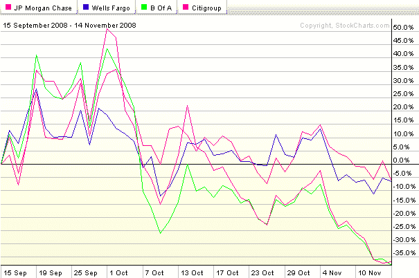

<!--yml
category: 未分类
date: 2024-05-18 18:16:03
-->

# VIX and More: The Big Four U.S. Banks

> 来源：[http://vixandmore.blogspot.com/2008/11/big-four-us-banks.html#0001-01-01](http://vixandmore.blogspot.com/2008/11/big-four-us-banks.html#0001-01-01)

The events of 2008 have completely reshaped the landscape of the U.S. commercial banking industry. At this point it looks as if four major banks will emerge as the dominant players: two relatively strong ones; and two that face a more challenging competitive environment. Here the charts identify the players nicely. From the peak of October 2007, Wells Fargo ([WFC](http://vixandmore.blogspot.com/search/label/WFC)) and JPMorgan Chase ([JPM](http://vixandmore.blogspot.com/search/label/JPM)) have each fallen about 20%, less than one half of the drop in the financial sector ETF, [XLF](http://vixandmore.blogspot.com/search/label/XLF). At the other end of the spectrum are Bank of America ([BAC](http://vixandmore.blogspot.com/search/label/BAC)) and Citigroup ([C](http://vixandmore.blogspot.com/search/label/C)), each of which has seen their stock drop at least 65% during this period. See the top chart for details. Refocus to the period since the failure of Bear Stearns (bottom chart) and the pattern is even more dramatic, with WFC and JPM each down a little more than 5% while BAC and C are down over 35%.

XLF made a new low of 11.70 on Thursday and is trading at about 12.00 as I type this. If XLF and the large commercial banks are not able to scrape out a bottom, then this market will not be able to sustain any rally. Better yet, add [XHB](http://vixandmore.blogspot.com/search/label/XHB) (homebuilders) and [XLY](http://vixandmore.blogspot.com/search/label/XLY) (consumer discretionary sector) to that list. A sustainable rally will require the participation of XLF, XHB, and XLY.

[source: StockCharts]