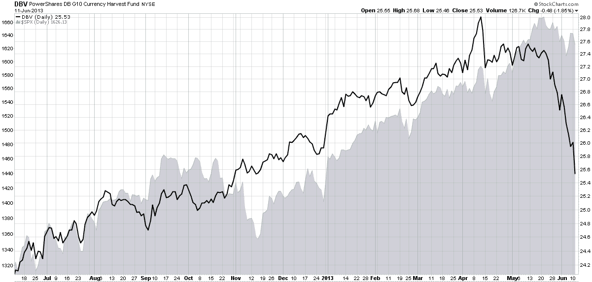

<!--yml
category: 未分类
date: 2024-05-18 16:16:17
-->

# VIX and More: The Currency Carry Trade, DBV and Risk

> 来源：[http://vixandmore.blogspot.com/2013/06/the-currency-carry-trade-dbv-and-risk.html#0001-01-01](http://vixandmore.blogspot.com/2013/06/the-currency-carry-trade-dbv-and-risk.html#0001-01-01)

Anyone who has been active in the financial markets during the past five years knows that there are many types of [risk](http://vixandmore.blogspot.com/search/label/risk), many ways to think about and measure risk, and invariably some risks lurking around the next corner that many of us have never bothered to contemplate. Most investors tend to focus their attention on equities and therefore have a tendency to think in terms of the CBOE Volatility Index (VIX) and use that number to evaluate the relative level of risk, uncertainty or perhaps fear in the markets. That being said, during the past few years, almost everyone has become conversant in such topics as [credit default swaps](http://vixandmore.blogspot.com/search/label/credit%20default%20swaps), the [TED spread](http://vixandmore.blogspot.com/search/label/TED%20spread), the LIBOR-OIS spread, bank capital ratios and a whole host of concepts and statistics which were not on their radar in 2007.

For a more holistic approach to evaluating risk, there is always the [St. Louis Fed’s Financial Stress Index](http://vixandmore.blogspot.com/search/label/STLFSI), which is one example of an attempt to aggregate a variety of risk factors ([18 in all](http://vixandmore.blogspot.com/2010/09/st-louis-feds-financial-stress-index.html)) related to economic and financial matters into a single risk index.

One aspect of market risk that many investors continue to struggle with is the currency carry trade. If the daily movements of the [dollar](http://vixandmore.blogspot.com/search/label/dollar) are relatively unimportant for those interested in buying and selling stocks that are primarily based in the U.S., then it is relatively easy for most investors to conclude that the gyrations of the [Japanese](http://vixandmore.blogspot.com/search/label/Japan) yen ([FXY](http://vixandmore.blogspot.com/search/label/FXY)) or Australian dollar ([FXA](http://vixandmore.blogspot.com/search/label/FXA)) can be dismissed as much less important than those of the dollar. Unfortunately, this is not always the case. It turns out that many investors, particularly large institutional ones, have an appetite for the currency carry trade, in which one borrows in a currency where interest rates are low and uses the proceeds to buy assets in a currency where interest rates are higher. With Japan’s central bank targeting interest rates of 0.1% and the Reserve Bank of Australia recently cutting its base rate to 2.75%, the carry trade is structured as an interest rate differential trade in which an investor can borrow in [yen](http://vixandmore.blogspot.com/search/label/Yen) and then buy Australian bonds, with profitability determined by the net interest rate differential plus or minus any fluctuation in the exchange rate.

Naturally some more aggressive investors prefer to use the yen as a funding currency for the purchase of assets other than bonds, including U.S. stocks. The problem for investors in U.S. stocks is that when the yen appreciates sharply – as it did on Monday and Thursday of last week, as well as during today’s session – traders with short yen positions who are victimized by a short squeeze will be subject to margin calls and/or forced liquidations, which means that not only are they covering their short yen positions, but they are also selling any long positions in U.S. equities as both legs are unwound. For this reason, when the yen carry trade is in favor, U.S. equities tend to move in the opposite direction of the yen. Traders can monitor the strength of the yen by following the USD/JPY currency cross or the Japanese yen ETF, FXY.

An alternative to focusing entirely on the yen is to monitor the PowerShares DB G10 Currency Harvest Fund ([DBV](http://vixandmore.blogspot.com/search/label/DBV)), which, as PowerShares indicates, “is composed of currency futures contracts on certain G10 currencies and is designed to exploit the trend that currencies associated with relatively high interest rates, on average, tend to rise in value relative to currencies associated with relatively low interest rates. The G10 currency universe from which the Index selects currently includes U.S. dollars, euros, Japanese yen, Canadian dollars, Swiss francs, British pounds, Australian dollars, New Zealand dollars, Norwegian krone and Swedish krona.”

In other words, DBV is a carry trade ETF that is short three currencies and long three currencies at all times, updating these [holdings](http://www.invescopowershares.com/products/overview.aspx?ticker=DBV#indexweights) on a quarterly basis. The ETF is currently short the Swiss franc, the euro and the yen, with long positions in the Australian dollar, the Norwegian krone and the New Zealand dollar.

As the chart below shows, DBV has been tracking the S&P 500 index quite closely for most of the past year, but that relationship has recently broken down as DBV has plummeted while the SPX has experienced only a mild pullback. Going forward, investors should strongly consider keeping an eye on the USD/JPY cross, the FXY ETF (which is optionable) and also DBV, which provides a much broader picture of the overall carry trade – and can also serve as a proxy for the risk this trade can pose to stocks.

*[In addition to the products referenced above, note that there is a currency carry trade ETF that is similar to DBV, the iPath Optimized Currency Carry ETN (*[*ICI*](http://vixandmore.blogspot.com/search/label/ICI)*), but this product has considerably less liquidity.]*

*[source(s): StockCharts.com]*

Related posts:

***Disclosure(s):*** *none*