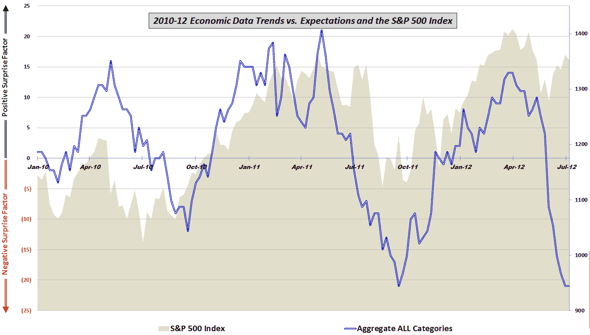

<!--yml
category: 未分类
date: 2024-05-18 16:26:46
-->

# VIX and More: The Economic Data Cliff

> 来源：[http://vixandmore.blogspot.com/2012/07/economic-data-cliff.html#0001-01-01](http://vixandmore.blogspot.com/2012/07/economic-data-cliff.html#0001-01-01)

Just a little over a month ago, in [Worst Post-2009 Week in Economic Data Relative to Expectations](http://vixandmore.blogspot.com/2012/06/worst-post-2009-week-in-economic-data.html) (no I have never written headlines for a living…) I detailed the rapidly deteriorating picture of economic data relative to consensus expectations.

After talking about the very disappointing economic reports, I noted the one historical parallel:

> *“[t]he only other time there was a week in which data was this poor relative to expectations was in the middle of February 2011, at which point the data was pulling back from an all-time high, about 2 ½ months before data and equities topped and began their swoon.”*

Five weeks later what looked like one bad week now looks like a horrific two month stretch. The chart below details the trend in economic data relative to expectations going back to the beginning of 2010\. Note that the last two months not only include the sharpest short-term decline in economic data in three years, but also reflect a stock market that seems decoupled from economic data for the first time since stocks began to rally in 2009.  Prevailing opinion is that the decoupling from economic reality is merely a case of postponing the inevitable decline in stocks, but there also exists the possibility that stock prices are beginning to reflect an economic turnaround at the end of the year or in early 2013.

*[Readers who are interested in more information on the component data included in this graphic and the methodology used are encouraged to check out the links below. For those seeking more details on the specific economic data releases which are part of my aggregate data calculations, check out* [*Chart of the Week: The Year in Economic Data (2010)*](http://vixandmore.blogspot.com/2011/01/chart-of-week-year-in-economic-data.html)*.]*

Related posts:

**

*[source(s): various]*

***Disclosure(s):*** *none*