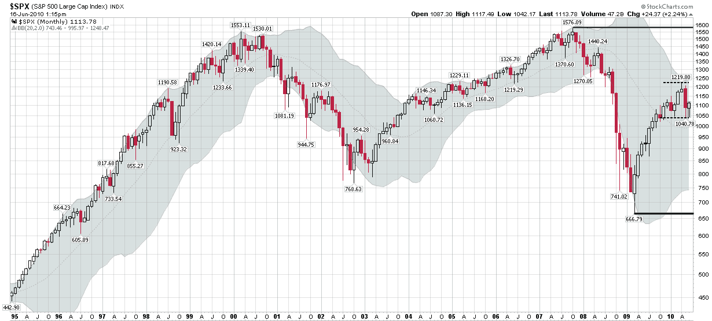

<!--yml
category: 未分类
date: 2024-05-18 17:07:53
-->

# VIX and More: The Elusive Trading Range

> 来源：[http://vixandmore.blogspot.com/2010/06/elusive-trading-range.html#0001-01-01](http://vixandmore.blogspot.com/2010/06/elusive-trading-range.html#0001-01-01)

During the course of the last year or two, stock market pundits have reminded me a little of politicians in the sense that I have seen a dramatic increase in both the polarization of ideas and the stridency of the tone in which various points of view are presented. To some extent, the two are related and the bifurcation is understandable. Strong macroeconomic winds are blowing and the range of possible outcomes now seemingly includes quite a few more extreme scenarios than it did just a few years ago. The move toward a more decentralized media has also probably reinforced this trend.

When it comes to politics, the decline of the moderate thinker can be at least partly explained by the nature of the institutions and political processes that tend to herd voters into opposing camps. In the investment world, the shrinking of the centrist philosophy is more difficult to understand. After all, if two equally extreme scenarios each have the same probabilities associated with them, then the mathematical expectation is zero and represents no change at all.

All of this leads me to the chart below, which utilizes monthly bars in the S&P 500 index. Five strong trends jump out in this chart:

1.  1990s bull market, capped by the dotcom craze
2.  2000-2002 technology-led bear market
3.  2002-2007 rally, with easy money and the Greenspan put
4.  2007-2009 bear market, with real estate and financials leading the way down
5.  2009-2010 bouncing off the bottom

Based on the chart alone, investors can certainly be excused for being conditioned to expect stocks to trend strongly in one direction or the other. The truth is that we haven’t seen a good sideways market in a long time and investors just don’t expect a trading range to develop any more. The centrists have either slowly gone broke or have been banished to Extremia (just west of Siberia, if I recall correctly.)

Since nobody else is talking about a trading range, I thought I would stick my neck out and predict that SPX 666-1219 will likely define a trading range going forward, but perhaps more importantly, the tighter 1040-1219 range could also serve as a trading range for a surprisingly long period. Just because there are two large extremist camps doesn’t mean that both bulls and bears can’t be wrong.

If the markets do settle into a trading range, then options selling strategies are likely to perform well, particularly if high volatility persists. This means [covered calls](http://vixandmore.blogspot.com/search/label/covered%20calls) may soon be back in vogue, with more advanced traders looking at the likes of [straddles](http://vixandmore.blogspot.com/search/label/straddle), [strangles](http://vixandmore.blogspot.com/search/label/strangle), [butterflies](http://vixandmore.blogspot.com/search/label/butterfly) and [condors](http://vixandmore.blogspot.com/search/label/condor).

For more on related subjects, readers are encouraged to check out:

*[source: StockCharts.com]*

***Disclosure(s):*** *none*