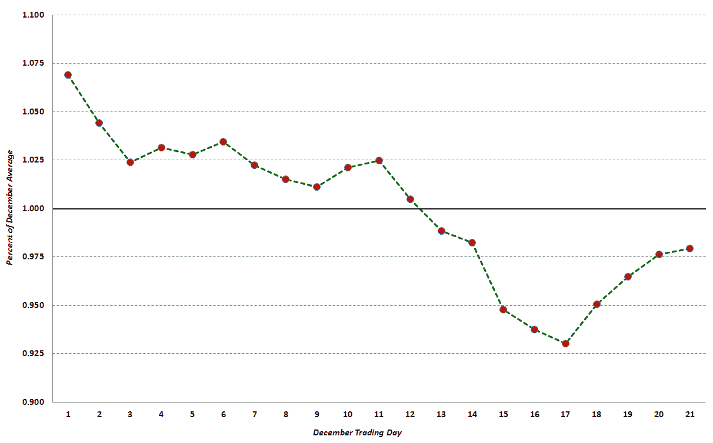
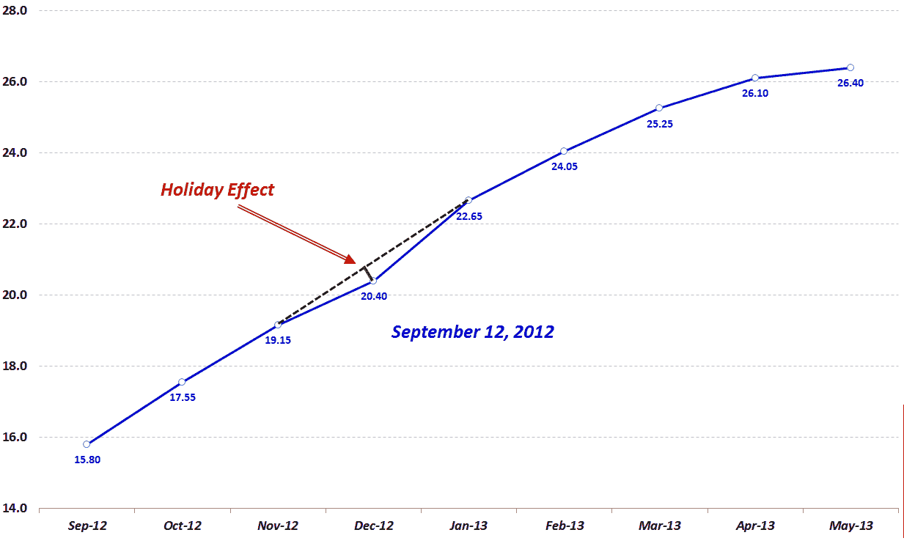

<!--yml
category: 未分类
date: 2024-05-18 16:12:20
-->

# VIX and More: The Evolution of the Holiday Effect in VIX Futures

> 来源：[http://vixandmore.blogspot.com/2013/11/the-evolution-of-holiday-effect-in-vix.html#0001-01-01](http://vixandmore.blogspot.com/2013/11/the-evolution-of-holiday-effect-in-vix.html#0001-01-01)

*[The following originally appeared in the November 2012 edition of Expiring Monthly: The Option Traders Journal. I thought the contents might be timely in light of the upcoming holiday season.]*

 *With fewer trading days and a historical record that favors an uptick in stocks and a downtick in volatility, the end of the year never fails to present an intriguing set of trading opportunities.

One phenomenon related to the above is something I have labeled the “[holiday effect](http://vixandmore.blogspot.com/search/label/Holiday%20Effect),” which is the tendency of the CBOE Volatility Index (VIX) December futures to trade at a discount to the midpoint of the VIX November and January futures.

This article provides some historical analysis of the holiday effect and analyzes how the holiday effect has been manifest and evolved over the course of the past few years.

**Background and Context on the Holiday Effect on the VIX Index**

Part of the explanation for the holiday effect is embedded in the historical record. For instance, in eight of the last twenty years, the VIX index has made its annual low during the month of December. In fact, the VIX has demonstrated a marked tendency to decline steadily for the first 17 trading days of the month, as shown below in Figure 1, which uses normalized VIX December data to compare all VIX values for each trading day dating back to 1990\. Not surprisingly, those 17 trading days neatly coincide with the typical number of December trading days in advance of the Christmas holiday.

*{Figure 1: The Composite December VIX Index, 1990-2011 (source: CBOE Futures Exchange, VIX and More)}*

Readers should also note that, on average, the steepest decline in the VIX usually occurs from the middle of the month right up to the Christmas holiday.

**The December VIX Futures Angle**

Most VIX traders are aware of the tendency of implied volatility in general and the VIX in particular to decline in December. As a result, since the launch of VIX futures in 2004, there has usually been a noticeable dip in the [VIX futures](http://vixandmore.blogspot.com/search/label/VIX%20futures) [term structure](http://vixandmore.blogspot.com/search/label/term%20structure) curve for the month of December. Figure 2 below is a snapshot of the VIX futures curve from September 12, 2012\. Here I have added a dotted black line to show what a linear interpolation of the December VIX futures would look like, with the green line showing the 0.50 point differential between the actual December VIX futures settlement value of 20.40 on that date and the 20.90 interpolated value, which is derived from the November and January VIX futures contracts. (Apart from the distortions present in the December VIX futures, a linear interpolation utilizing the first and third month VIX futures normally provides an excellent estimate of the value of the second month VIX futures.)

*{Figure 2: VIX Futures Curve from September 12, 2012 Showing Holiday Effect (source: CBOE Futures Exchange, VIX and More)}*

Looking at the full record of historical data, the mean holiday effect for all days in which the November, December and January futures traded is 1.87%, which means that the December VIX futures have been, on average, 1.87% lower than the value predicted by a linear interpolation of the November and January VIX futures. Further analysis reveals that on 91% of all trading days, the December VIX futures are lower than their November-January interpolated value. The holiday effect, therefore, is persistent and substantial.

**The History of the Holiday Effect in the December VIX Futures**

Determining whether the holiday effect is statistically significant is a more daunting task, as there are only six holiday seasons from which one can derive meaningful VIX futures data. Figure 3 shows the monthly average VIX December futures (solid blue line) as well as the midpoint of the November and the January VIX futures (dotted red line) for each month since the VIX futures consecutive contracts were launched in October 2006\. Here the green bars represent the magnitude of the holiday effect expressed in percentage terms, with the sign inverted (i.e., a +2% holiday effect means that the VIX December futures would be 2% *below* the interpolated value derived from November and January futures.)

*{Figure 3: VIX December Futures Holiday Effect, 2006-2012 (source: CBOE Futures Exchange, VIX and More)}* 

**Conclusions**

With limited data from which to draw conclusions, it is tempting to eyeball the data and look for emerging patterns which may repeat in the future. Clearly one pattern is that an elevated or rising VIX appears to coincide with a larger magnitude holiday effect, whereas a depressed or falling VIX is consistent with a smaller holiday effect. The data is much less compelling when one tries to determine whether the time remaining until the holiday season has an influence on the magnitude of the holiday effect. While one might expect the holiday effect to become magnified later in the season, the evidence to support this hypothesis is scant at this stage.

To sum up, investors have readily accepted that a lower VIX is warranted for December and the downward blip in December for the VIX futures term structure reflects this thinking. As far as whether this [seasonal anomaly](http://vixandmore.blogspot.com/search/label/seasonality) is tradable, there is still a limited amount of data – not to mention some highly unusual volatility years – from which to develop and back test a robust VIX futures strategy designed to capture the holiday effect.

In terms of trading the holiday effect for the remainder of the year, the coming holiday season is also complicated by matters such as the fiscal cliff deadline and various euro zone milestones that are set for early 2013\. In fact, there may not be a reasonable equivalent since the Y2K fears in late 1999 that turned out to be a volatility non-event when the calendar flipped to 2000.

While the opportunities to capitalize on the 2012 holiday effect may be difficult to pinpoint and fleeting, all investors should be attuned to seasonal volatility cycles as 2013 unfolds and volatility expectations ebb and flow with the news cycle as well as the calendar.

Related posts:

Other articles republished from Expiring Monthly:

***Disclosure(s):*** *none**