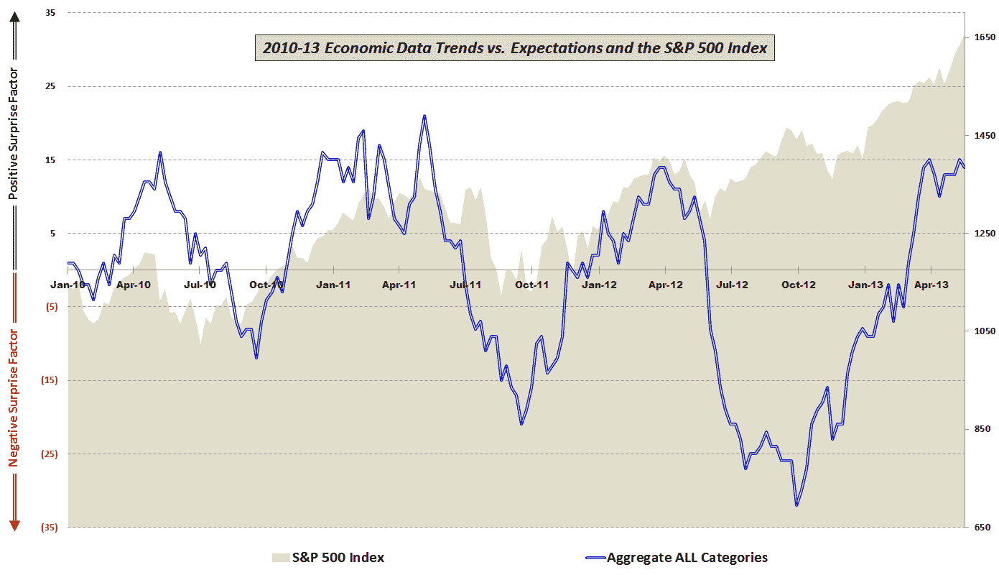

<!--yml
category: 未分类
date: 2024-05-18 16:16:28
-->

# VIX and More: The Fed, QE, the Economy and Goldilocks 2.0

> 来源：[http://vixandmore.blogspot.com/2013/05/the-fed-qe-economy-and-goldilocks-20.html#0001-01-01](http://vixandmore.blogspot.com/2013/05/the-fed-qe-economy-and-goldilocks-20.html#0001-01-01)

It was never easy being a central banker and the job has become much more difficult over the course of the last five years or so, but right now the task of guiding monetary policy and juggling the myriad of threats to economic stability is particularly daunting.

Take the Fed, for instance. The [current policy statement](http://online.wsj.com/article/BT-CO-20130501-711798.html?mod=googlenews_wsj) calls for $85 billion of bond purchases each month, until the unemployment rate is below 6.5%, as long as inflation expectations do not rise above 2.5%.

At some point, however, the Fed will have to taper its bond purchases and ultimately begin selling some of its bond holdings. The big questions surround when to begin reversing course and how dramatic the increments will be in those policy changes.

With the unemployment rate and rate of inflation highlighted as the key data points for determining the timing and magnitude of the policy changes, the task of slowing and ultimately reversing the quantitative easing policy seems reasonably straightforward, at least in theory.

One big problem is that the unemployment rate may not be a very good gauge of the health of the economy. The chart below shows economic data reports relative to expectations over the course of the last 3 ½ years. Note that up until about a year ago, there was a very strong correlation between the performance of the S&P 500 index and whether economic data beat or missed consensus estimates. The correlation resumed when economic data turned up in the end of September, but a new divergence arose when economic data began stalling about two months ago, while stocks have been making new highs.

*[source(s): various]*

Looking at the five components of the economic data, one can see that for the past eight months or so there has been a favorable trend in housing/construction, employment, the consumer, and prices/inflation. As the graphic below illustrates, the one category that has been consistently missing expectations, particularly over the course of the last five weeks, has been manufacturing and general economic data, a category that includes reports such as [GDP](http://vixandmore.blogspot.com/search/label/GDP), [ISM](http://vixandmore.blogspot.com/search/label/ISM), [Industrial Production](http://vixandmore.blogspot.com/search/label/industrial%20production), Capacity Utilization, Durable Goods, Factory Orders, Regional Fed Indices, Productivity, etc.

*[source(s): various]*

The problem for the Fed is that even though even though the consumer, housing / construction and aggregate unemployment rates all suggest an improving economy, the manufacturing sector and employment measures such as the labor force participation rate ([official BLS graphic](http://data.bls.gov/timeseries/LNS11300000)) paint a picture of continuing economic weakness.

As an investor, one has to guess how the Fed will handle this evolving conundrum. My general sense is that bulls will be rewarded if the economic data continue to fall slightly short of expectations and help to persuade the Fed that maintaining or perhaps even increasing bond purchases is the best policy approach – all of which should be a positive for stocks. Should economic data, particularly the employment component, begin to top estimates on a regular basis then we are left with the likely conclusion that the Fed will begin to remove the QE safety net relatively quickly. At the other end of the spectrum, if data fall well short of expectations going forward, the more perplexing conclusion is that even with its expanding toolbox, efforts by the Fed to prop up the economy are having at best a temporary effect and are also demonstrating diminishing returns. For investors, the data sweet spot going forward – or Goldilocks zone, if you will – is likely to be a series of near misses that extends the current policy indefinitely.

*[Readers who are interested in more information on the component data included in this graphic and the methodology used are encouraged to check out the links below. For those seeking more details on the specific economic data releases which are part of my aggregate data calculations, check out* [*Chart of the Week: The Year in Economic Data (2010)*](http://vixandmore.blogspot.com/2011/01/chart-of-week-year-in-economic-data.html)*.]*

Related posts:

***Disclosure(s):*** *none*