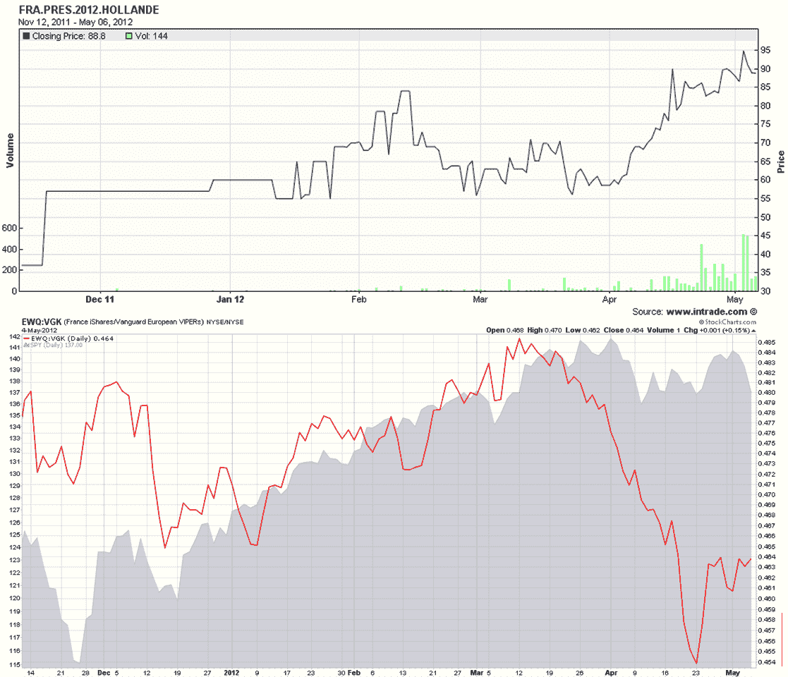
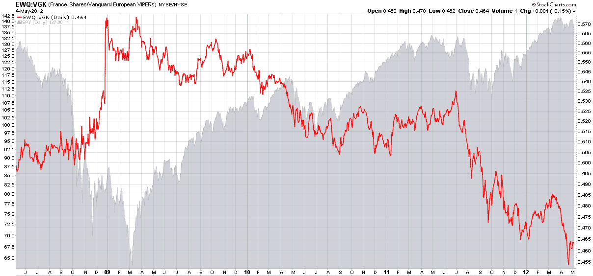

<!--yml
category: 未分类
date: 2024-05-18 16:30:57
-->

# VIX and More: The Hollande Discount

> 来源：[http://vixandmore.blogspot.com/2012/05/hollande-discount.html#0001-01-01](http://vixandmore.blogspot.com/2012/05/hollande-discount.html#0001-01-01)

With a little more than an hour to go before the equity markets open in Europe, investors are still attempting to digest the significance of an electoral victory for Francois Hollande in [France](http://vixandmore.blogspot.com/search/label/France) as well as a much more fragmented political scene in [Greece](http://vixandmore.blogspot.com/search/label/Greece), where the radical leftist [Syriza](http://vixandmore.blogspot.com/search/label/Syriza) party showed surprising strength.

While the outcome of the election in Greece was very difficult to handicap, the probability of a Hollande victory increased dramatically over the course of the last month or so.

The [chart of the week](http://vixandmore.blogspot.com/search/label/chart%20of%20the%20week)below shows the likelihood of a Hollande victory as indicated by the [Intrade](http://vixandmore.blogspot.com/search/label/Intrade) election contract (solid black line in upper half of top chart) since the second week of November. At the same time support for Holland was growing, one can see that the expectations for a Hollande victory put pressure on [France](http://vixandmore.blogspot.com/search/label/France) ETF, ([EWQ](http://vixandmore.blogspot.com/search/label/EWQ)). The bottom half of the top chart shows a ratio of the EWQ to the broader Europe ETF, [VGK](http://vixandmore.blogspot.com/search/label/VGK) as a solid red line. This ratio has declined sharply in conjunction with Hollande’s increasing strength in the polls and has moved in the opposite direction of U.S. stocks (gray area chart) since the middle of March.

For some additional context, I have also included a bottom chart that captures the EWQ:VGK ratio and the SPY going back four years. Note that France was generally a source of relative strength in the euro zone through June 2011 and has struggled relative to its peer group for most of the past year.

Looking at the full set of charts, it is apparent that the markets have been pricing in the likely impact of a Hollande victory for the better part of a month. With U.S. equity futures down approximately 1% as I type this, my sense is that the Hollande discount has almost completely priced in, but the increased uncertainty in Greece is likely to roil the markets and put a jolt into volatility expectations for at least the next few weeks going forward.

Related posts:

**

**

*[source(s): StockCharts.com, Intrade.com]*

***Disclosure(s):*** *none*