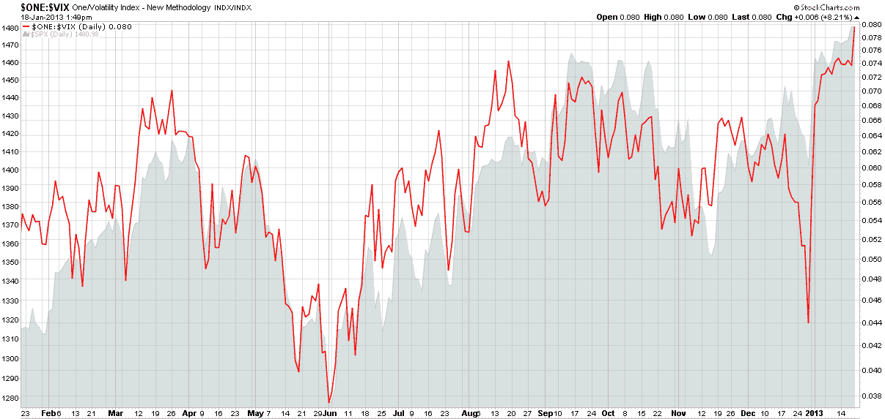

<!--yml
category: 未分类
date: 2024-05-18 16:19:14
-->

# VIX and More: The Inverted Percentile VIX

> 来源：[http://vixandmore.blogspot.com/2013/01/the-inverted-percentile-vix.html#0001-01-01](http://vixandmore.blogspot.com/2013/01/the-inverted-percentile-vix.html#0001-01-01)

Of the many reasons that investors have a tendency to struggle with an interpretation of the VIX, one of the most obvious is an issue of orientation: for the most part, the VIX moves in the opposite direction of stocks. Frankly, it is difficult to appreciate some of the nuances of an upside-down world unless you spend a lot of time hanging upside down looking out at the world, like a bat.

It is partly for this reason that I created the “[inverted VIX](http://vixandmore.blogspot.com/search/label/inverted%20VIX)” back in August 2007\. At that time, the VIX had just spiked into the mid-20s only two months after having traded in the 12s. The chart below is an updated version of the inverted VIX over the course of the past year and demonstrates that for the most part, the SPX and the inverted VIX track fairly closely, though there are times, such as just prior to the [fiscal cliff](http://vixandmore.blogspot.com/search/label/fiscal%20cliff) denouement, when the VIX sometimes strikes out on its own path.

*[source(s): StockCharts.com]*

Today we are seeing a VIX of about 12.50 – the lowest the index has been since June 2007 – and once again investors are grappling for the proper context. Let me throw a new concept into the mix that may help: the [inverted percentile VIX](http://vixandmore.blogspot.com/search/label/inverted%20percentile%20VIX), a distant cousin of the inverted VIX. The way to think about the inverted percentile VIX is in terms of the lifetime of VIX values, in which a VIX of 12.50 is in the 12.2 percentile. The inverse of that is the 87.8 percentile, which corresponds with a VIX of 28.67\. Now I am guessing that for most investors a VIX of 12.50 *feels* much lower than a VIX of 28.67 feels high. Statistically they are almost identical in terms of being outliers, so if a 28.67 VIX doesn’t sound like a scary high number, then a VIX of 12.50 should not sound like a scary low number that is reflecting too much complacency.

Investors may wish to consider recalibrating their emotions and expectations or, failing that, take advantage of the relatively low VIX by buying some VIX calls so as to profit when the rest of the world comes to the realization that a VIX in the 12s is making them too nervous. Keep in mind, however, that current 10-day [historical volatility](http://vixandmore.blogspot.com/search/label/historical%20volatility) of the SPX is in the 5s, so that number would have to double just to be able to support the current level of the VIX going forward.

Related posts:

***Disclosure(s):*** *none*